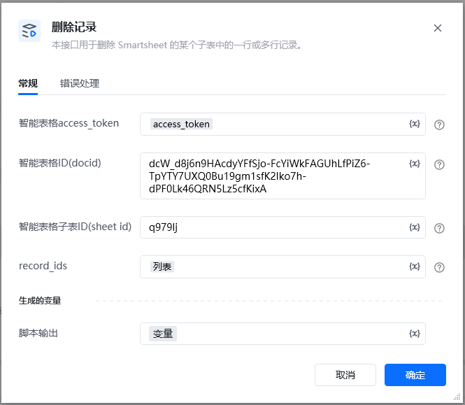
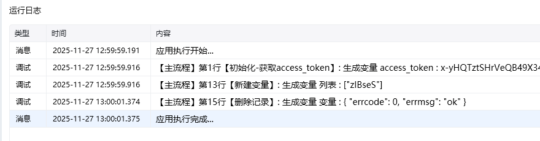

# 删除记录
## 描述

该指令旨在在智能表格中删除记录
## 参数配置
### 指令输入
### 常规

<strong>智能表格access_token：</strong>通过指令【建立智能表格连接】获取

<strong>智能表格ID(docid)：</strong>字符串;可通过【新建智能表格】指令获取，注意新建表格后生成的docid要自己保存，后续遗忘无法找回

<strong>智能表格子表ID(sheet_id)：</strong>字符串;通过指令【查询子表】查找智能表格子表ID(sheet_id)

<strong>记录ID列表：</strong>列表;要删除的记录ID列表

可以通过在线表格里面添加公式RECORD_ID() 获取record_id

### 指令输出

<Info>
  使用指令过程中遇到问题？前往 [八爪鱼RPA 开发者社区问答板块](https://rpa.bazhuayu.com/community/questions) 提问，获取官方与社区帮助。
</Info>
