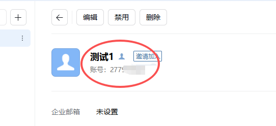
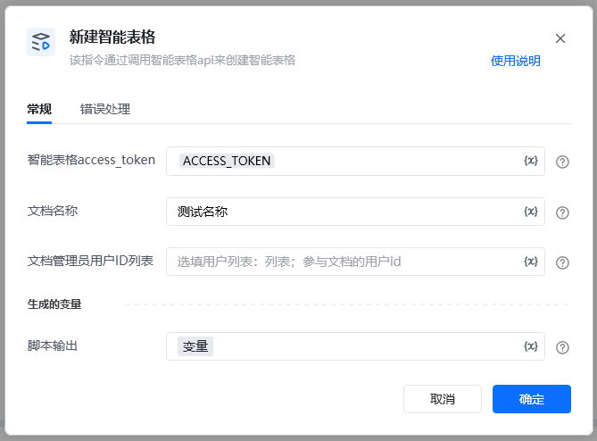
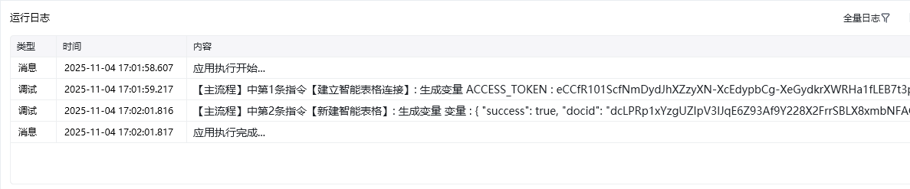

新建企业微信智能表格

<strong>1.注意新建表格后生成的docid要自己保存，后续遗忘无法找回</strong>

<strong>2.客户端新建智能表不能通过api修改</strong>
## 描述

该指令通过调用智能表格api来创建智能表格
## 参数配置
### 指令输入
### 常规

<strong>智能表格access_token：</strong>通过指令【建立智能表格连接】获取

<strong>文档名字</strong>：字符串；自定义文档名称

<strong>管理员用户id</strong>：选填列表；参与文档的用户id

如何获取用户id

企业微信后台——通讯录——组织架构——点击某个成员——账号就是用户id

### 指令输出

<strong>响应内容</strong>：字典；返回响应内容

<Info>
  使用指令过程中遇到问题？前往 [八爪鱼RPA 开发者社区问答板块](https://rpa.bazhuayu.com/community/questions) 提问，获取官方与社区帮助。
</Info>
