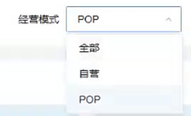
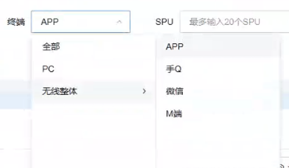
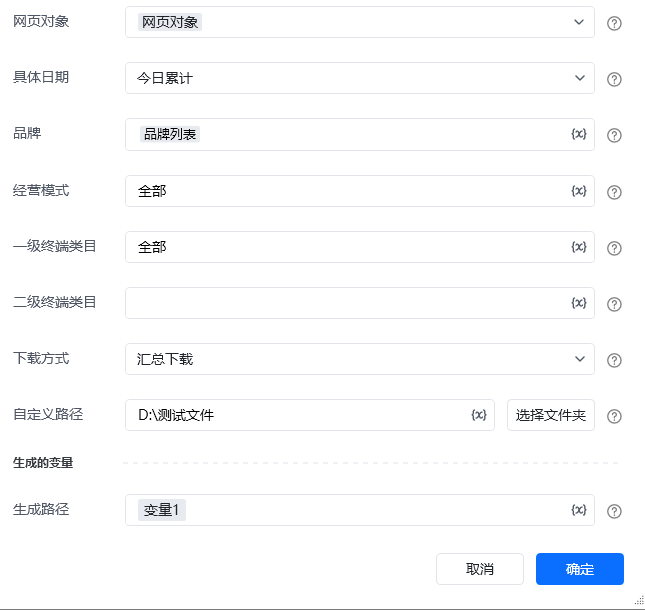

# 描述

该指令实现获取实时-实时概况页面的实时概况数据，并指定位置

# 配置项说明
## 指令输入
#### 网页对象：

任意一个已登录京东商智品牌版后台的网页对象

<strong>具体日期:</strong>

下拉框，可选：今日累计、昨日晚8累计、今日、昨日、自定义

<strong>开始时间：</strong>

当选择自定义时填写，格式：YYYY-MM-DD

<strong>结束时间：</strong>

当选择自定义时填写，格式：YYYY-MM-DD

<strong>开始时间点：</strong>

当选择今日、昨日、自定义时填写，格式：00

<strong>结束时间点：</strong>

当选择今日、昨日、自定义时填写，格式：00

<strong>品牌:</strong>

数据类型:文本值列表，填写自己网页中展示的品牌名称,例如:["全部"]，支持多选

<strong>经营模式:</strong>

填写自己网页中展示的经营模式,例如:全部

一级终端类目名称：

输入具体类目。若选择一级类目，直接输入一级类目名称，例如：全部

二级终端类目名称：

输入具体类目。若选择二级类目，直接输入二级类目名称，例如：APP。类目名称需要与网站显示的名称一致，否则可能导致无法选择，二级终端类目名称选填

<strong>自定义路径:</strong>

选择下载文件保存的文件夹路径，必填项
## 高级
#### 自定义文件名:

输入文件下载的名称，选填，若不填则使用平台默认名称
## 指令输出
#### 生成路径：

输出文本类型，下载的文件路径
# 使用说明

<Info>
  使用指令过程中遇到问题？前往 [八爪鱼RPA 开发者社区问答板块](https://rpa.bazhuayu.com/community/questions) 提问，获取官方与社区帮助。
</Info>
