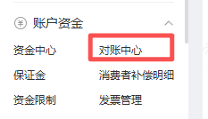
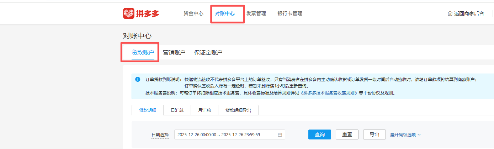
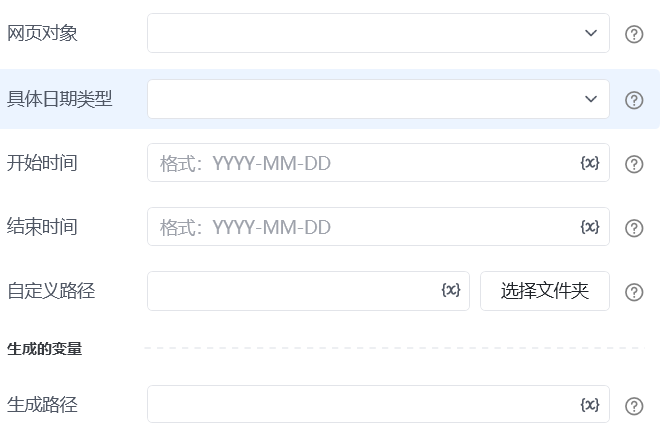

### 指令使用描述：

该指令用于自动下载拼多多对账中心货款账户的贷款明细并保存结果。

# 配置说明
## 输入

<strong>网页对象:</strong> 传入已打开对应页面的网页对象。

<strong>具体日期类型:</strong>下拉框，例如：今天、昨天、最近7天、最近30天

<strong>开始日期：</strong>对账明细的开始时间，时间格式为YYYY-MM-DD

<strong>结束日期：</strong>对账明细的结束时间，时间格式为YYYY-MM-DD

自定义路径：文件存放地址

<strong>自定义文件名称：</strong>字符串，请输入压缩包保存名称，如test，不需要文件名后缀[如test，不需要文件名后缀](http://如test.zip)

## 输出

<Info>
  使用指令过程中遇到问题？前往 [八爪鱼RPA 开发者社区问答板块](https://rpa.bazhuayu.com/community/questions) 提问，获取官方与社区帮助。
</Info>
