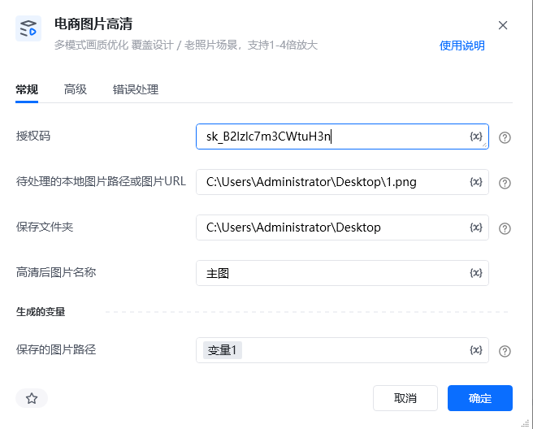

# 一、指令概述

该RPA指令依托新奇AI客户授权码（https://customer.xinqiai.cn/注册可获得试用，在个人中心获取SK开头），支持单张图片网络URL、本地图片绝对路径两种输入方式，依托AI超分辨率算法实现图像智能化高清升级。在放大图像分辨率的同时，可精准修复并强化画面细节纹理，有效抑制、降低图像噪声；内置<strong>普通、增强</strong>两种固定处理模式，可输出差异化画质优化效果，全面覆盖电商图片、设计素材、老旧照片等全品类画质提升需求。功能支持原分辨率画质增强与1-4倍分辨率放大，可根据实际业务场景灵活选择输出放大规格。

指令支持处理完成后自动将高清成品图片保存至指定本地文件夹，支持自定义图片文件名；未填写自定义名称时，系统自动生成带时间戳的唯一文件名，避免文件覆盖冲突。单张图片处理成本约0.08元，最终成品图片完整本地路径自动存入输出变量，可直接对接后续图片编辑、商品上架、设计印刷等自动化流程，适配各类图片高清化业务需求。

<strong>重要限制</strong>：本指令仅支持单张图片单独处理，不支持URL列表、批量本地图片路径批量导入，批量图片高清优化需搭配循环指令逐条执行。
# 二、参数配置说明

参数名称示例/默认值参数说明授权码新奇AI授权码（字符串）填写已开通图片高清优化权限的新奇AI有效授权码，用于调用AI超分辨率接口，支持静态填写及变量传入。需要处理的图片URL/本地图片路径https://img.cdnfe.com/product/fancy/26ff8093-b929-43c7-93c1-b443eda36861.jpg支持单条公开图片网络URL、单条本地图片绝对路径两种输入方式，支持单值变量传入；不支持URL列表、批量路径、相对路径、防盗链加密链接、需要登录访问的私有图片链接。本地保存文件夹路径D:\电商高清素材填写高清成品图片保存的本地文件夹绝对路径，无需填写文件名及后缀；目标文件夹不存在时，指令可自动新建多级目录，支持变量传入。自定义图片保存名称product_hd_001自定义高清优化后图片文件名，无需额外添加格式后缀；留空则系统自动生成时间戳文件名，防止同名文件覆盖，支持变量传入。图片放大倍数2（默认）可选1-4倍分辨率放大档位，1倍为原分辨率画质增强，仅优化清晰度不改变图片尺寸；2-4倍同步放大图片尺寸+提升画质，档位越高图片分辨率越高、文件体积越大。输出模式普通（默认）仅支持两种固定模式：①普通模式：均衡画质优化，平衡细节还原与降噪效果，画面自然不锐化过度，适配绝大多数电商产品图；②增强模式：强力细节修复与降噪，针对模糊严重、画质极差的图片做深度高清修复，适合老旧照片、严重低清素材。生成的变量-保存的图片路径hdSaveImagePath自定义输出变量，存储高清优化完成后图片完整本地绝对路径（包含文件夹、文件名、图片后缀），可直接被后续所有本地图片类RPA指令调用。
# 三、使用示例
适用场景设计素材优化：对存量设计素材进行画质优化与分辨率升级，输出高清规范的素材文件，可直接用于后续设计生产、印刷制作等业务环节；照片清晰度提升：针对历史老旧照片、低分辨率拍摄照片进行细节修复与清晰度增强，还原画面质感与色彩层次，实现老旧影像素材的画质焕新；电商商品图提质：优化店铺低清主图、详情图，提升商品画面清晰度，适配跨境电商平台高清图片上架要求，提升商品页面视觉展示效果。
## 参数配置参考

指令：电商图片高清

授权码：https://customer.xinqiai.cn/注册可获得试用，在个人中心获取SK开头（自定义授权码变量）

需要处理的图片URL/本地图片路径：仅支持单条图片链接或单条本地图片路径变量

本地保存文件夹路径：自定义本地素材存放目录变量

自定义图片保存名称：自定义文件名，留空自动生成时间戳名称

图片放大倍数：2

输出模式：普通

生成的变量-保存的图片路径：hdSaveImagePath

# 四、执行流程

配置完成后运行指令，系统依次完成全流程自动化处理：首先校验图片地址、保存路径、放大倍数、输出模式全部参数合法性，随后调用AI超分辨率高清接口，根据选定的普通/增强模式，搭配对应放大倍数，自动完成图片降噪、纹理细节修复、分辨率放大、画质增强处理；处理完毕后自动将高清图片保存至指定本地目录，按自定义名称命名文件，无自定义名称则自动生成时间戳文件，最后将完整本地保存路径存入输出变量，全程无需人工操作。
# 五、运行效果

输入低清网络图片或本地图片，可按需选择两种优化模式：普通模式输出画面自然柔和、无过度锐化，适配日常电商产品图；增强模式深度修复模糊画面、补齐缺失细节，大幅提升低质图片清晰度。同时支持1-4倍无损放大，处理后图片无噪点、无失真，成品自动保存本地并返回路径变量，可直接对接后续所有自动化流程。
六、注意事项前往https://customer.xinqiai.cn/注册账号可领取试用额度并获取SK开头授权码，新账号数据同步存在延迟，未显示授权码可等待几分钟后重新登录或联系客服。正式运行前需保证账户余额充足、图片高清优化权限已开通，授权码过期、欠费、权限缺失均会触发系统内部异常，接口调用失败。仅支持单张图片单次处理，禁止传入批量URL列表、数组变量、相对路径、网盘路径、移动磁盘临时路径，违规参数会直接导致任务报错终止。支持JPG、PNG两种主流图片格式；原图破损严重、画面大面积缺失，无法完成有效细节修复，高清提升效果会受限。本地保存文件夹必须填写绝对路径，路径禁止包含非法特殊字符；目录不存在时指令可自动新建，无需手动提前创建文件夹。自定义文件名无需填写格式后缀，默认jpg格式；目录存在同名文件会直接覆盖，重要素材建议搭配时间戳变量避免文件丢失。放大倍数仅限1-4倍整数，超出区间会直接参数报错；1倍仅提升清晰度不变尺寸，4倍放大后图片体积会明显变大，按需选择即可。模式选择建议：常规电商产品图、清晰原图选普通模式；模糊老旧照片、严重压缩低清图选增强模式，避免模式选错导致优化效果不佳。仅图片高清处理+本地保存全部完成后才会计费，图片读取失败、网络中断、保存失败等异常情况均不扣费。使用本地图片也需要联网调用AI接口，网络超时、防火墙拦截会造成处理失败，排查网络后可重新运行指令。所有输入输出变量均为单值文本变量，不可使用列表、数组等异常变量，防止参数读取失败、结果无法存储。
七、延伸应用批量图片高清提质：搭配循环指令批量遍历图片链接/本地路径，统一模式和放大倍数，实现大批量图片无人值守高清修复与本地归档。电商全流程素材处理：衔接图片抠图、图片翻译、白底图生成指令，先对低清原图做高清修复，再进行后续图片加工，保障全流程图片素材画质统一。老旧图片批量焕新：针对店铺历史旧素材、老旧存档照片，统一使用增强模式修复，低成本完成存量图片画质升级。印刷素材预处理：选用普通模式高清优化图片，保证画面自然不失真，满足印刷、海报制作等高清出图要求。
## 八、首次使用

首次使用时，会报错提示“Python包未找到”，点击“立刻安装即可”。如下图操作：

<Info>
  使用指令过程中遇到问题？前往 [八爪鱼RPA 开发者社区问答板块](https://rpa.bazhuayu.com/community/questions) 提问，获取官方与社区帮助。
</Info>
