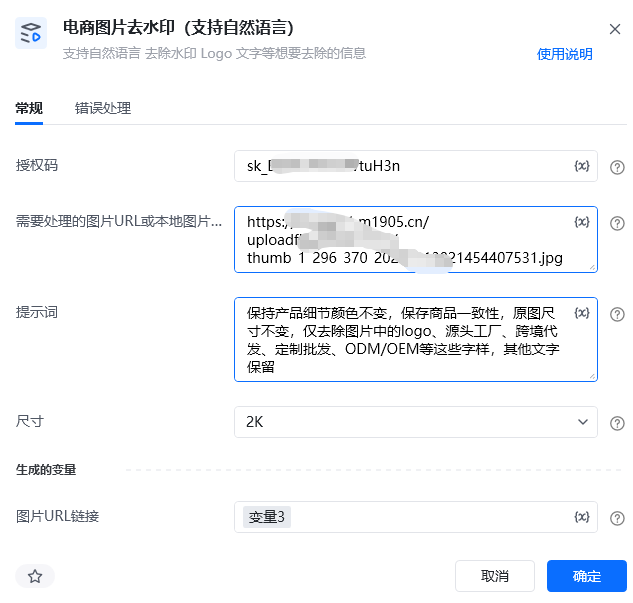
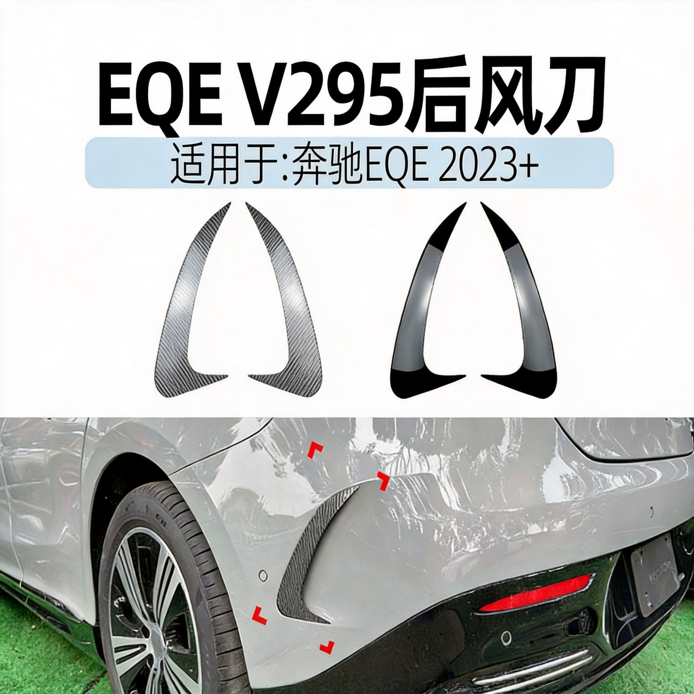

# 一、指令概述

该RPA指令依托新奇AI客户授权码（https://customer.xinqiai.cn/注册可获得试用，在个人中心获取SK开头），支持单张图片网络URL、本地图片绝对路径两种输入方式，搭配自然语言提示词，智能识别图片内水印、品牌Logo、多余文字等各类画面冗余标识并完成无痕去除。系统依托专业图像分析算法，自动精准定位待去除元素区域，结合图片周边原生纹理、色彩以及光影细节进行AI智能填充修复，全程完整保留图片主体内容、画面画质与原生色彩质感，修复完成后画面过渡自然顺滑，无马赛克、无模糊色块、无生硬修复痕迹。

指令支持去水印完成后，将图片URL路径输出为变量，单张图片处理成本约0.25元，可无缝衔接后续各类图片处理流程。广泛适用于电商产品原图净化、营销宣传素材优化、参考资料配图规整等场景，快速提升图片整洁度与商用合规性。

<strong>重要限制</strong>：本指令仅支持单张图片单独处理，不支持URL列表、批量本地图片路径批量导入，批量图片去水印需搭配循环指令逐条执行。
# 二、参数配置说明

参数名称示例/默认值参数说明授权码新奇AI授权码（字符串）填写已开通图片去水印权限的新奇AI有效授权码，用于调用AI图像修复接口，支持静态填写及变量传入。需要处理的图片URL/本地图片路径https://img.cdnfe.com/product/fancy/26ff8093-b929-43c7-93c1-b443eda36861.jpg支持单条公开图片网络URL、单条本地图片绝对路径两种输入方式，支持单值变量传入；不支持URL列表、批量路径、相对路径、防盗链加密链接、需要登录访问的私有图片链接。自然语言去水印提示词去除图片右下角品牌水印以及底部白色文字通过自然语言描述需要清除的内容、具体位置与范围，描述越精准，水印去除效果越好，避免误删图片主体内容；支持静态文本输入与变量传入。尺寸2K支持自定义1K-4K自定义尺寸，越大生成时间越长。生成的变量-图片URL链接图片URL链接自定义输出变量，，可直接被后续所有本地图片类RPA指令调用。
# 三、使用示例
适用场景电商产品图净化：清除供应商原图自带水印、第三方品牌Logo、渠道标识，产出干净无冗余元素的商品主图、详情图，满足电商平台图片上架规范；营销素材优化：清理宣传海报、推广素材上多余文字、水印及标识，无需手动修图，快速复用参考素材制作自有营销物料；参考配图规整：去除行业参考图、资料配图上的各类水印与广告文字，统一图片画面整洁度，提升图片商用适配性。
## 参数配置参考

指令：电商图片去水印（支持自然语言）

授权码：https://customer.xinqiai.cn/注册可获得试用，在个人中心获取SK开头（自定义授权码变量）

需要处理的图片URL/本地图片路径：仅支持单条图片链接或单条本地图片路径变量

自然语言去水印提示词：按需填写去除内容及位置

尺寸：2K

生成的变量-图片URL链接：图片URL链接

# 四、执行流程

配置完成后运行指令，系统全自动完成全流程处理：首先校验授权码有效性、图片地址合法性、提示词文本合规性以及本地保存路径有效性；随后调用AI图像修复接口，根据输入的自然语言提示词智能定位水印、Logo等冗余区域，结合周边画面纹理完成像素级无痕修复；修复完成后自动将干净图片生成图片URL链接，全程无需人工干预。
# 五、运行效果

输入带水印、品牌Logo、多余文字的电商原图，搭配精准自然语言提示词，即可彻底清除画面冗余元素，修复区域和原图画面完美融合，无模糊、无断层、无修图痕迹；原图商品主体、色彩、画质细节完全保留，成品图片自动落地保存至本地文件夹，同时输出精准本地路径变量，可直接对接图片高清、图片抠图等后续自动化指令。

示例图片提示词：保持产品细节颜色不变，保存商品一致性，原图尺寸不变，仅去除图片中的logo、源头工厂、跨境代发、定制批发、ODM/OEM等这些字样，其他文字保留

六、注意事项前往https://customer.xinqiai.cn/注册账号可领取试用额度并获取SK开头授权码，新账号数据同步存在延迟，未显示授权码可等待几分钟后重新登录或联系客服。正式运行前需保证账户余额充足、图片去水印权限已开通，授权码过期、欠费、权限缺失均会触发系统内部异常，接口调用失败。仅支持单张图片单次处理，禁止传入批量URL列表、数组变量、相对路径、网盘路径、移动磁盘临时路径，违规参数会直接导致任务报错终止。支持JPG、PNG两种主流图片格式，单张图片大小不超过4MB；若水印大面积覆盖图片主体商品、画面纹理极度复杂，会小幅影响修复效果，建议拆分区域分两次去除。自然语言提示词建议写明位置+去除内容，描述过于笼统容易出现去除不彻底、误删商品主体细节的问题，清晰直白的文案可大幅提升修复准确率。仅图片去水印修复+本地保存全部完成后才会计费，图片读取失败、网络中断、修复失败、保存失败等异常情况均不扣除账户费用。即便使用本地图片作为输入源，运行全程也需要保持网络通畅，网络超时、防火墙拦截会导致AI接口调用失败，排查网络后可重新执行指令。所有输入输出变量均为单值文本变量，不可使用列表、数组、数字等异常变量类型，否则会出现参数读取失败、结果无法存储的问题。
七、延伸应用批量图片去水印：搭配循环指令批量遍历图片链接或本地图片路径，统一标准化提示词，实现大批量电商素材无人值守自动净化，降低人工修图成本。电商图片全链路自动化：前置对接图片采集指令，后置衔接图片高清、白底图生成指令，实现图片采集→去水印修复→画质增强→成品归档一站式自动化流程。竞品素材合规处理：自动抓取竞品商品图片后，一键去除竞品品牌水印与标识，快速生成可正常复用的参考设计素材。本地素材闭环处理：搭配图片URL下载指令，将处理完的图片下载至本地，适配后续内网封闭自动化流程。
## 八、首次使用

首次使用时，会报错提示“Python包未找到”，点击“立刻安装即可”。如下图操作：

<Info>
  使用指令过程中遇到问题？前往 [八爪鱼RPA 开发者社区问答板块](https://rpa.bazhuayu.com/community/questions) 提问，获取官方与社区帮助。
</Info>
