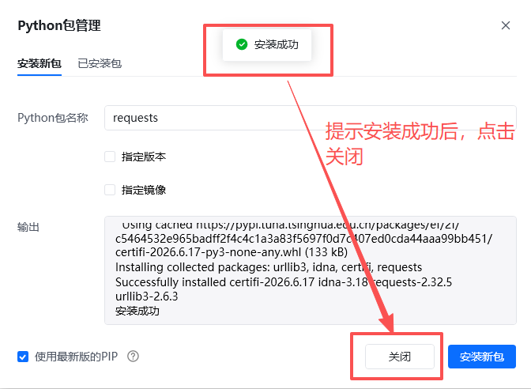

# 一、指令概述

该RPA指令依托新奇AI客户授权码（https://customer.xinqiai.cn/注册可获得试用，在个人中心获取SK开头），支持单张图片网络URL、本地图片绝对路径两种输入方式，依托AI人像识别与高精度图像分割算法，自动精准定位图片内人物头部区域并完成精细化无痕抠图。支持单人头像、多人同框头像同步识别抠取，适配各类拍摄角度、人物姿态、不同画质的人像原图，完整保留发丝、首饰配饰、妆容细节，输出边缘无锯齿、无杂边、干净顺滑的高清透明底PNG头像素材。

AI抠图完成后可直接将处理好的透明底头像自动保存至指定本地文件夹，支持自定义图片文件名；若未填写自定义名称，系统将自动生成时间戳唯一文件名，避免文件覆盖冲突。单张图片处理成本约0.03元，最终成品图片完整本地路径自动存入输出变量，可直接对接后续本地图片处理流程。广泛适配POD按需打印定制、证件照制作、社交头像生成、企业员工档案处理、设计素材合成等业务场景。

<strong>重要限制</strong>：本指令仅支持单张图片单独处理，不支持URL列表、批量本地图片路径批量导入，批量头像抠图需搭配循环指令逐条执行。
# 二、参数配置说明

参数名称示例/默认值参数说明授权码新奇AI授权码（字符串）填写已开通人像头像抠图权限的新奇AI有效授权码，用于调用AI人像分割接口，支持静态填写及变量传入。需要处理的图片URL/本地图片路径https://img.cdnfe.com/product/fancy/26ff8093-b929-43c7-93c1-b443eda36861.jpg支持单条公开图片网络URL、单条本地图片绝对路径两种输入方式，支持单值变量传入；不支持URL列表、批量路径、相对路径、防盗链加密链接、需要登录访问的私有图片链接。本地保存文件夹路径D:\POD定制头像素材填写图片成品保存的本地文件夹绝对路径，无需填写文件名及后缀；目标文件夹不存在时，指令可自动新建多级目录，支持变量传入。自定义图片保存名称user_avatar_001自定义抠图后图片文件名，无需额外添加格式后缀，指令默认统一保存为透明底PNG格式；留空则系统自动生成时间戳文件名，防止同名文件覆盖，支持变量传入。生成的变量-保存的图片路径finalSaveImagePath自定义输出变量，存储抠图完成后图片完整本地绝对路径（包含文件夹、文件名、图片后缀），可直接被后续所有本地图片类RPA指令调用。
# 三、使用示例
适用场景POD个性化定制生产：自动抠取透明底头像并本地归档，直接用于人像抱枕、马克杯、定制服饰、手机壳、钥匙挂件、装饰画等定制产品出图，省去人工抠图、下载、保存全流程操作；办公人像批量处理：批量制作社交头像、证件照底稿、企业员工档案头像，自动规整保存至指定目录，提升人事素材整理效率；设计素材自动化制备：一键生成无背景透明人像素材，自动保存至本地设计素材库，可直接用于海报、宣传图、纪念册图文合成。
## 参数配置参考

指令：POD定制人物头像专用抠图

授权码：https://customer.xinqiai.cn/注册可获得试用，在个人中心获取SK开头（自定义授权码变量）

需要处理的图片URL/本地图片路径：仅支持单条图片链接或单条本地图片路径变量

本地保存文件夹路径：自定义本地素材存放目录变量

自定义图片保存名称：自定义文件名，留空自动生成时间戳名称

生成的变量-保存的图片路径：finalSaveImagePath
# 四、执行流程

配置完成后运行指令，系统依次完成参数校验、AI抠图、本地保存、变量输出全流程：首先校验图片链接/本地路径有效性、本地保存目录合法性，随后调用AI人像抠图接口完成头像精准分割去背景，处理完成后按照设定文件名自动保存至目标本地文件夹，无自定义名称则自动匹配时间戳命名，最终将完整的图片本地保存路径存入指定输出变量，全程无人工干预。
# 五、运行效果

输入网络图片链接或本地人像图片，即可自动输出发丝完整、边缘干净无杂边的透明底PNG头像，自动落地保存至指定本地文件夹，支持自定义文件名区分订单与素材；同时返回精准本地文件路径，可无缝衔接后续图片编辑、产品合成、订单出图等自动化流程。

示例图片链接： https://www.1905.com/newgallery/hdpic/1703507.shtml#p1[https://www.1905.com/newgallery/hdpic/1703507.shtml#p1](https://www.1905.com/newgallery/hdpic/1703507.shtml#p1)

六、注意事项前往https://customer.xinqiai.cn/注册账号可领取试用额度并获取SK开头授权码，新账号数据同步存在延迟，未显示授权码可等待几分钟后重新登录或联系客服。正式运行前需保证账户余额充足、人像抠图权限已开通，授权码过期、欠费、权限缺失均会触发系统内部异常，接口调用失败。仅支持单张图片单次处理，禁止传入批量URL列表、数组变量、相对路径、网盘路径、移动磁盘临时路径，违规参数会直接导致任务报错终止。支持JPG、PNG两种主流图片格式，单张图片大小不超过4MB；图片人脸遮挡严重、光线过曝/过暗、画面极度模糊，会降低发丝与边缘抠图精准度。本地文件夹路径必须填写绝对路径，路径避免包含特殊符号、非法字符；若目标目录不存在，指令会自动新建文件夹，无需手动提前创建。自定义文件名无需添加后缀，指令默认输出透明底PNG格式；若文件夹内存在同名文件，系统会直接覆盖原有文件，重要素材建议搭配变量区分文件名。指令仅对成功完成抠图并保存的图片计费，图片读取失败、网络超时、目录写入失败等未完成全流程的情况，均不扣除账户费用。运行全程需要保持网络通畅，即便使用本地图片输入，也需联网调用AI接口；网络中断、防火墙拦截会导致抠图失败，排查网络后可重新执行指令。所有输入、输出变量均为单值文本变量，不可使用列表、数组、数字等异常变量类型，否则会出现参数读取失败、结果无法存储的问题。多人同框图片会一次性抠出全部人物头像，如需单独提取单人头像，建议提前裁剪图片后再执行本指令。
七、延伸应用批量POD订单自动处理：搭配循环指令遍历多张人像图片地址，逐条自动抠图+命名+本地保存，实现大批量定制订单头像素材无人值守处理。全流程定制自动化：对接订单抓取、图片模板合成指令，完成用户上传图片→AI头像抠图→本地保存→产品图合成一站式自动化流程。前后指令联动使用：可前置搭配图片URL下载指令，线上图片下载至本地后再调用本指令抠图，适配全本地图片处理链路。图片二次加工联动：衔接图片尺寸修改、背景替换指令，调用本指令输出的本地路径，直接读取成品头像进行二次编辑，完善定制产品图片。
## 八、首次使用

首次使用时，会报错提示“Python包未找到”，点击“立刻安装即可”。如下图操作：

<Info>
  使用指令过程中遇到问题？前往 [八爪鱼RPA 开发者社区问答板块](https://rpa.bazhuayu.com/community/questions) 提问，获取官方与社区帮助。
</Info>
