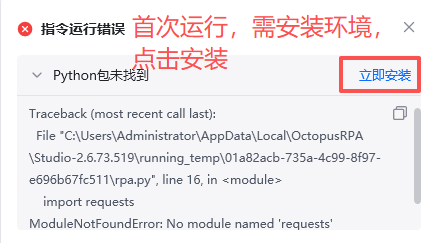
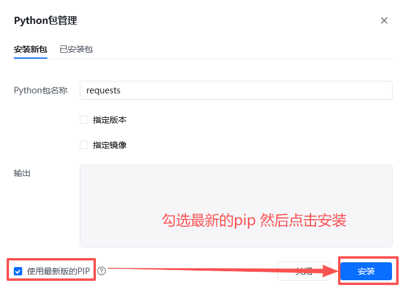

# 一、指令概述

该RPA指令依托新奇AI客户授权码（https://customer.xinqiai.cn/注册可获得试用，在个人中心获取SK开头），搭载GPT-Image-2生图大模型，是面向高品质电商场景打造的高阶图生图智能重绘工具，在创意生成能力、产品细节还原度、画面光影质感、提示词遵循精度上均达到行业顶尖水平，满足品牌级电商商用图片的高精度出图要求。指令支持网络图片URL、本地图片绝对路径两种图片输入方式，以上传的产品原图为基础底图，搭配自定义文字提示词，即可完成商品图片高精度重绘、场景替换、文案修改、风格升级等专业操作。

模型针对电商商品做了深度专项优化，重绘过程中可精准锁定产品主体，极致还原产品外观造型、材质纹理、品牌标识、结构细节等核心特征，有效杜绝主体变形、特征丢失、画质模糊、光影违和等常见问题，确保生成图片与实物产品高度一致，画面质感达到专业商业摄影级标准。可实现高端背景替换、真人级模特更换、穿搭风格定制、品牌级展示场景重构等多种处理效果，无需专业修图技能，即可批量产出高品质商用电商素材。处理完成后自动将成品图片保存至指定本地文件夹，支持自定义文件名，最终输出成品图片完整本地路径变量，可无缝对接后续各类图片处理RPA流程。

<strong>重要限制</strong>：本指令仅支持单张图片单次重绘生成，不支持批量图片URL、批量本地路径一次性导入，批量图片重绘需要搭配循环指令逐条执行。
# 二、参数配置说明

参数名称示例/默认值参数说明授权码新奇AI授权码（字符串）填写已开通GPT-Image-2图生图接口权限的有效新奇AI授权码，用于调用旗舰级AI图像生成接口，支持手动填写固定值，也支持变量传入。需要处理的图片URL或本地图片路径https://img.cdnfe.com/product/fancy/26ff8093-b929-43c7-93c1-b443eda36861.jpg支持单条公开无防盗链网络图片链接、单条本地图片绝对路径两种输入方式，作为图生图的基底参考图；仅支持单值变量，不支持批量链接、本地路径列表、相对路径、需要登录鉴权的私有图片链接。提示词保留产品主体不变，更换为高端轻奢展厅背景，柔光打光，商业摄影质感自然语言输入重绘需求，可描述更换场景、修改文案、调整光影、更换模特、升级风格等要求，建议提示词内注明保留产品主体，避免产品细节改动；GPT-Image-2模型对提示词识别精度更高，支持更细腻的效果描述，支持变量传入。图片保存路径D:\电商高端成品素材填写成品图片保存的本地文件夹绝对路径，无需填写文件名及后缀；若指定的多级目录不存在，指令将自动创建对应文件夹，支持变量传入。图片名称高端产品主图_001自定义生成后图片的文件名，无需额外添加格式后缀；不填写时系统自动生成带时间戳的唯一文件名，避免同名文件覆盖，支持变量传入。生成的变量-生成图片的本地路径gptImgLocalPath自定义输出变量，存储重绘完成后高清成品图片的完整本地绝对路径（包含文件夹、文件名、图片后缀），可直接被后续所有本地图片类RPA指令调用。
# 三、使用示例
适用场景高端商品主图优化：生成多版本高品质差异化主图用于平台A/B测试与高端店铺展示，全程无损保留产品核心细节，无需专业棚拍即可产出商业摄影级主图，高效验证高转化视觉方案。品牌级详情页配图：为高端产品匹配实景展厅、轻奢居家、商务办公等高品质使用场景，提升详情页视觉档次，同时保证全页产品外观、质感、特征高度统一。真人级模特穿搭迭代：生成高度真实的人物模特与穿搭效果，适配不同客群定位与品牌风格，产品主体细节始终精准一致，大幅降低模特拍摄成本与周期。品牌营销素材生产：一键生成大促活动、品牌主题、节日限定的高品质宣传图与海报素材，画面质感统一、风格调性精准匹配品牌定位，高效响应高端营销节点需求。高端新品测款筹备：短时间内批量产出多场景、多风格的高品质新品展示图用于投放测款，产品还原度与画面真实度远超常规模型，可更精准地验证市场接受度。跨渠道高品质内容适配：生成适配品牌官网、高端种草社区、精品电商平台的高质量配图，满足全渠道高端品牌形象的内容输出要求。
## 参数配置参考

指令：图生图（GPT-Image-2最强生图模型）

授权码：https://customer.xinqiai.cn/注册可获得试用，在个人中心获取SK开头（自定义授权码变量）

需要处理的图片URL或本地图片路径：仅支持单条图片链接或单条本地图片路径变量

提示词：保留产品主体不变，更换为极简高级感背景，柔和自然光，商业摄影质感

图片保存路径：自定义本地素材存放目录变量

图片名称：自定义文件名，留空自动生成时间戳名称

生成的变量-生成图片的本地路径：gptImgLocalPath
# 四、执行流程

指令运行后，系统依次完成全流程自动化处理：第一步校验授权码有效性、图片地址合法性、提示词合规性、本地保存路径规范性；第二步将原图与自定义提示词同步上传至GPT-Image-2旗舰生图接口；第三步AI模型精准锁定产品主体，按照提示词完成场景重绘、细节优化、光影渲染、风格调整，生成高保真成品图片；第四步自动将成品图片写入指定本地保存文件夹，按自定义名称命名文件，无自定义名称则自动生成时间戳文件名；最后将完整的图片本地存储路径存入预设输出变量，全程无需人工干预操作。
# 五、运行效果

上传任意电商产品原图，输入对应提示词即可完成高精度无损重绘，产品外观、纹理、标识、结构全部完整保留，无变形、无模糊、无细节丢失；画面背景、光影、模特、场景完全按照提示词精准呈现，光影自然真实、质感细腻高级，达到专业商业摄影级标准。成品图片自动落地保存至指定本地文件夹，命名规范清晰，同时返回精准本地文件路径，可直接用于品牌店铺上架、高端营销投放与专业设计加工。
六、注意事项前往https://customer.xinqiai.cn/注册账号可领取试用额度，获取SK开头专属授权码；新账号存在数据同步延迟，未显示授权码可等待几分钟后重新登录。正式使用需保证账户余额充足、GPT-Image-2图生图接口权限已开通，授权码过期、欠费、权限不足均会导致接口调用失败，返回系统内部异常报错。仅支持单张图片单次生成，禁止传入图片列表、数组变量、相对路径、网盘路径、移动存储设备临时路径，非法参数会直接报错终止任务。支持JPG、PNG两种主流电商图片格式，单张原图大小不超过10MB；若原图产品占比过小、画面过度模糊、主体严重遮挡，会小幅影响产品主体锁定与细节还原精度，建议上传主体清晰、画质完好的原图以获得最优效果。提示词描述越细腻精准，生成效果贴合度越高，建议明确标注保留产品主体，并补充光影、风格、质感等细节要求；禁止输入违规、侵权、虚假宣传类生成提示词，违规内容会直接拦截无法生成图片。本地图片保存路径必须填写绝对路径，路径中避免包含特殊非法字符与异常空格，防止文件写入失败；目标文件夹不存在时指令会自动新建多级目录，无需手动提前创建。自定义图片名称无需填写格式后缀，指令默认输出高清通用格式；若目标文件夹内已存在同名同格式文件，将直接覆盖原有文件，重要素材建议搭配时间戳、产品SKU等变量生成唯一文件名。指令仅在图片成功生成并完成本地保存后扣除费用，图片读取失败、网络中断、生成失败、文件写入失败等异常情况，均不会扣除账户余额。无论使用网络图片还是本地图片作为输入，运行时必须保持网络通畅，离线状态无法调用GPT-Image-2生图接口；网络超时、防火墙拦截、代理异常均会导致处理失败，排查网络后可重新执行指令。所有输入、输出变量均为单值文本变量，不可使用列表、数字、数组等异常变量类型，避免出现参数读取失败、结果无法存储的问题。
七、延伸应用高端素材批量生产：搭配循环指令，批量遍历产品图片链接，统一提示词风格与画质标准，全自动批量完成品牌级商品图重绘、场景替换，大幅降低高端素材的制作成本与周期。品牌电商全流程自动化：衔接图片去水印、图片高清精修指令，原图净化优化后再进行GPT-Image-2高阶重绘，实现原图处理→创意重绘→成品归档一站式高端自动化流程。品牌视觉统一升级：统一设置提示词风格与画质标准，对全店商品图片进行批量重绘升级，打造高度统一的高端品牌视觉形象，提升店铺整体调性。高品质新品研发辅助：快速生成多款新品设计、包装、场景的高质量效果图，辅助选品决策与设计方案评估，大幅减少实物打样的时间与成本。
## 八、首次使用

首次使用时，会报错提示“Python包未找到”，点击“立刻安装即可”。如下图操作：

<Info>
  使用指令过程中遇到问题？前往 [八爪鱼RPA 开发者社区问答板块](https://rpa.bazhuayu.com/community/questions) 提问，获取官方与社区帮助。
</Info>
