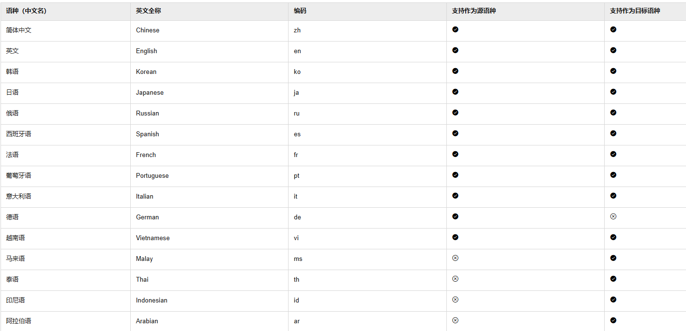
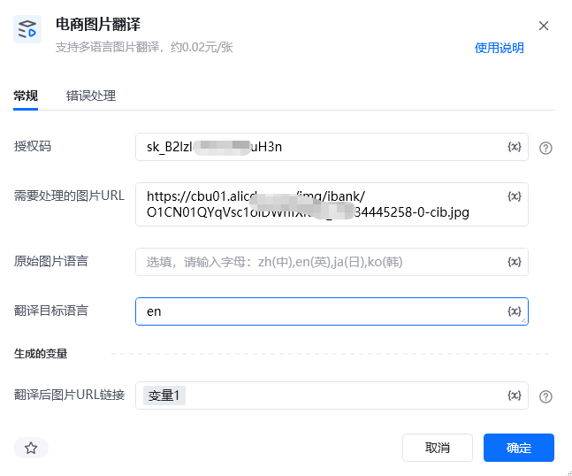
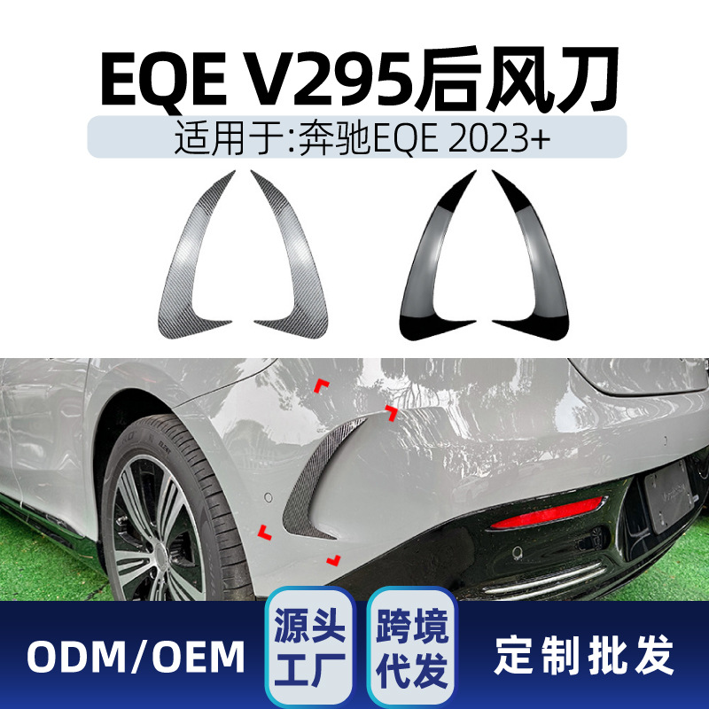

# 一、指令概述

该RPA指令依托新奇AI客户授权码（https://customer.xinqiai.cn/[https://customer.xinqiai.cn/](https://customer.xinqiai.cn/)注册可获得试用，在个人中心获取SK开头），输入单张含文字内容的网络图片URL链接，即可一键完成图片文字OCR识别、智能翻译、原图文字替换还原全流程操作，支持中英日韩法德西等全球数十种主流语言双向互译，翻译结果贴合跨境电商、外贸营销真实用语习惯，适配TEMU、亚马逊、Shein、阿里国际站等全品类跨境电商平台图片本地化需求。单张图片翻译处理成本约0.02元。翻译完成后的原图排版还原翻译图在线链接结果会自动存入自定义变量，可直接用于商品主图翻译、详情页海报汉化/外文化、产品说明书图片转译、跨境营销物料本地化等各类外贸图文处理业务场景。

<strong>重要限制</strong>：本指令仅支持单条图片URL处理，不支持URL列表、批量链接输入，批量图片翻译需搭配循环指令逐条执行；仅支持网络公开图片链接，不支持本地离线图片直接上传翻译。
# 二、参数配置说明

参数名称示例/默认值参数说明授权码新奇AI授权码（字符串）填写已开通图片翻译权限的新奇AI有效授权码，用于调用AI图文翻译接口，支持静态填写及变量传入。需要处理的图片URLhttps://cbu01.alicdn.com/img/ibank/O1CN01QYqVsc1oiDWhfXKlM_!!3834445258-0-cib.jpg仅支持填写单条、公开可访问、无访问权限限制的产品图片/海报图片网络链接，支持单值变量传入，不支持URL列表、本地路径、登录鉴权链接、加密私有链接。源语言自动识别（默认）或手动输入（英文简写）如：zh图片原始文字语种，默认开启AI自动语种识别，也可手动指定中文、英语、日语、韩语等固定语种，减少识别误差，提升翻译精准度。目标翻译语言手动输入（英文简写）如：en需要转换的目标语种，适配跨境电商主流运营语种，可按需切换小语种，满足不同站点图文本地化需求，暂不支持德语作为目标语言生成变量-翻译后图片urltranslatedImageUrl自定义变量，用于存储排版还原后的完整翻译图片在线链接，图片保留原图尺寸、版式、字体位置，可直接上架使用。

注意：源语言 和目标语言详见下图：

# 三、使用示例
适用场景跨境电商商品图文本地化：国内中文产品海报、参数说明图一键翻译成英文、小语种版本，适配海外各平台站点规则；海外图文素材汉化：外文产品主图、营销海报、售后说明图片一键转为中文，方便国内运营人员审核编辑；批量图文文案提取：自动抓取图片内所有文案并同步翻译，省去人工打字录入、人工翻译的繁琐步骤。
## 参数配置参考

指令：图片智能翻译

授权码：https://customer.xinqiai.cn/[https://customer.xinqiai.cn/](https://customer.xinqiai.cn/)注册可获得试用，在个人中心获取SK开头（自定义授权码变量）

需要处理的图片URL：仅支持单条公开产品/海报图片链接变量

源语言：自动识别

目标翻译语言：英语

生成变量-翻译后图片url：translatedImageUrl

# 四、执行流程

配置完成后运行指令，系统自动携带授权码、图片链接、语种参数请求新奇AI图文翻译接口，依次完成图片无损压缩、全域文字OCR精准识别、语义智能翻译、原图文字覆盖还原、画质修复五大步骤，全程无需人工干预。处理成功后，将排版一致的翻译成品图链接、原文+译文文本分别存入对应自定义变量，可供后续所有RPA流程直接调用。
# 五、运行效果

输入带原生文字的产品原图链接，输出<strong>版式完全一致、文字精准翻译、无排版错乱、无额外水印</strong>的成品翻译图片；图片尺寸、背景、构图、字体位置和原图完全保持一致，仅替换文字内容，翻译语义贴合跨境电商专业话术，无机器翻译生硬问题，直接满足平台图文发布要求。

（直观对比：翻译前原图文字 / 翻译后成品图文）
六、注意事项授权码与账户权限要求：https://customer.xinqiai.cn/注册可获得试用，在个人中心获取SK开头授权码；刚注册账户存在数据同步延迟，未显示授权码可等待5-10分钟后重新登录，或直接联系平台客服人工开通权限。正式自动化运行前务必核查账户余额、图文翻译接口权限，授权码过期、账户欠费、未开通OCR图文权限，均会直接触发系统内部异常，接口调用失败。图片链接输入规范：严格遵循单URL处理规则，禁止传入URL列表、数组变量、本地图片路径、需要登录/验证码/权限验证才能访问的私有图片链接，违规输入会直接返回接口报错，任务终止。图片格式与大小限制：支持图片格式为JPG、PNG、WEBP三大主流电商图片格式，单张图片大小不超过4MB；图片模糊度过高、反光严重、文字倾斜遮挡、艺术花体字过多，会导致文字识别不全、翻译偏差，建议保证原图文字清晰可辨。计费规则说明：指令按成功识别并完成翻译的图片张数计费，单次图文完整翻译成功即扣除对应费用；仅识别文字失败、网络超时未完成翻译不扣费，测试阶段建议使用平台提供的免费测试图片链接，避免无效扣费损耗余额。网络运行环境要求：RPA运行全程需保持设备网络稳定通畅，网络波动、超时、代理异常、防火墙拦截均会导致接口请求失败，出现系统内部异常报错，此类网络问题不会重复扣费，排查网络后可重新执行任务。变量配置规范：输入输出变量均为单值文本变量，不可使用列表变量、数组变量、数字变量等异常变量类型；请勿随意修改变量格式，否则会出现返回数据无法存储、后续指令调用变量失效等问题。语种适配说明：小众小语种翻译精准度略低于主流中英日韩语种，小语种场景建议手动指定源语言，关闭自动识别功能，进一步提升翻译准确率。
七、延伸应用批量图片自动翻译：搭配RPA循环指令，遍历本地整理好的图片URL清单，逐条调用本图片翻译指令，实现大批量产品海报、详情图无人值守自动翻译，适配店铺全站点图文本地化运营。跨境图文一站式上架：对接商品发布、素材上传RPA指令，直接调用翻译完成后的图片链接自动填充商品主图、详情页海报，实现图片翻译→图文上传→商品发布全流程自动化。图文文案自动化归档：联动表格写入指令，将自动提取的图片同步录入Excel表格，完成跨境图文文案统一归档，方便运营人员复盘、文案复用。前后端图文协同处理：可衔接图片白底处理、图片尺寸裁剪、图片压缩等前置后置RPA指令，先完成图片白底标准化处理，再执行图文翻译，产出完全符合跨境平台尺寸、背景、文字三重规范的标准化商品素材。

<Info>
  使用指令过程中遇到问题？前往 [八爪鱼RPA 开发者社区问答板块](https://rpa.bazhuayu.com/community/questions) 提问，获取官方与社区帮助。
</Info>
