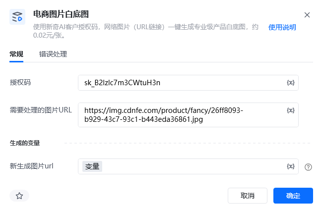

## 一、指令概述

该RPA指令依托新奇AI客户授权码（ https://customer.xinqiai.cn/[https://customer.xinqiai.cn/](https://customer.xinqiai.cn/)注册可获得试用，在个人中心获取SK开头），输入单张电商产品网络图片URL链接，即可一键生成符合TEMU、亚马逊、Shein等主流跨境电商平台规范的专业产品白底图，单张图片处理成本约0.02元。生成完成后的白底图在线链接会自动存入自定义变量，可直接用于商品上架、图片替换、素材整理等各类电商业务场景。

<strong>重要限制</strong>：本指令仅支持<strong>单条图片URL</strong>处理，不支持URL列表、批量链接输入，批量处理需搭配循环指令逐条执行。
## 二、参数配置说明

参数名称示例/默认值参数说明授权码新奇AI授权码（字符串）填写已开通白底图权限的新奇AI有效授权码，用于调用AI接口，支持静态填写及变量传入。需要处理的图片URLhttps://img.cdnfe.com/product/fancy/26ff8093-b929-43c7-93c1-b443eda36861.jpg仅支持填写单条、公开可访问的产品图片网络链接，支持单值变量传入，不支持URL列表、本地路径、加密权限链接。生成的变量-新生成图片urlwhiteBgImageUrl自定义变量，用于存储AI处理完成后的白底图在线链接，可被后续所有流程指令调用。
## 三、使用示例
### 适用场景

跨境电商产品素材处理，将产品原图网络链接快速转换为平台通用纯白底产品展示图，满足商品上架、主图替换、素材合规化需求。
### 参数配置参考

指令：电商图片白底图

授权码： https://customer.xinqiai.cn/[https://customer.xinqiai.cn/](https://customer.xinqiai.cn/)注册可获得试用，在个人中心获取SK开头（自定义授权码变量）

需要处理的图片URL：仅支持单条产品图片链接变量

生成的变量-新生成图片url：返回产品白底图URL链接

### 执行流程

配置完成后运行指令，系统自动携带授权码和单张图片URL请求新奇AI接口，自动完成图片抠图、白底填充、画质优化处理，处理成功后将全新白底图在线链接存入指定变量。
### 运行效果

输入普通产品原图链接，输出标准化纯白底产品图片链接，图片无水印、无杂物、背景纯净，完全适配各大跨境电商平台上架规范，示例： https://img.cdnfe.com/product/fancy/26ff8093-b929-43c7-93c1-b443eda36861.jpg[https://img.cdnfe.com/product/fancy/26ff8093-b929-43c7-93c1-b443eda36861.jpg](https://img.cdnfe.com/product/fancy/26ff8093-b929-43c7-93c1-b443eda36861.jpg)

<strong>抠图前后</strong>         

## 四、注意事项

1.   https://customer.xinqiai.cn/  [https://customer.xinqiai.cn/  ](https://customer.xinqiai.cn/注册可获得试用，在个人中心获取开头)注册可获得试用，在个人中心获取SK开头，如刚注册未显示授权码，可稍等几分钟重新登录或联系客服。投入生产时应保证账户余额充足、权限正常，授权码过期、欠费、权限不足均会导致接口调用失败。

2.  严格适配单URL处理规则，禁止传入URL列表、数组变量、本地图片路径、需要登录/加密才能访问的图片链接，否则直接处理报错。

3.  支持图片格式为JPG、PNG，单张图片大小不超过3MB，图像分辨率小于2000*2000，超出格式或大小限制会导致处理失败。

4.  指令按成功处理张数计费，单次有效处理即扣除对应费用，测试运行时建议使用测试图片链接，避免无效扣费。

5.  运行过程需保持设备网络通畅，网络超时、网络中断会导致图片处理失败，不重复扣费。

6.  变量配置需规范，输入输出变量均为单值文本变量，不可使用列表、数字等异常变量类型。
## 五、延伸应用

1.  批量自动化处理：搭配RPA循环指令，遍历图片URL列表，逐条调用本指令处理，实现大批量产品白底图自动生成。

2.  电商上架全流程：对接商品上架指令，将生成的白底图链接自动填充至商品主图、详情图位置，完成素材处理+商品上架一体化自动化流程。

3.  图片二次加工：可衔接图片尺寸修改、水印添加、图片压缩等指令，生成完全符合平台精细化规范的产品素材。
## 六、首次使用

首次使用时，会报错提示“Python包未找到”，点击“立刻安装即可”。如下图操作：

<Info>
  使用指令过程中遇到问题？前往 [八爪鱼RPA 开发者社区问答板块](https://rpa.bazhuayu.com/community/questions) 提问，获取官方与社区帮助。
</Info>
