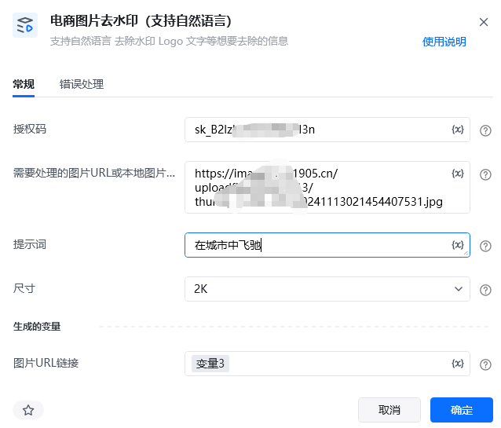
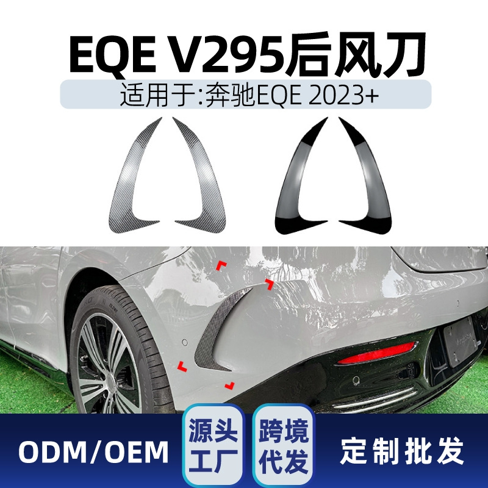
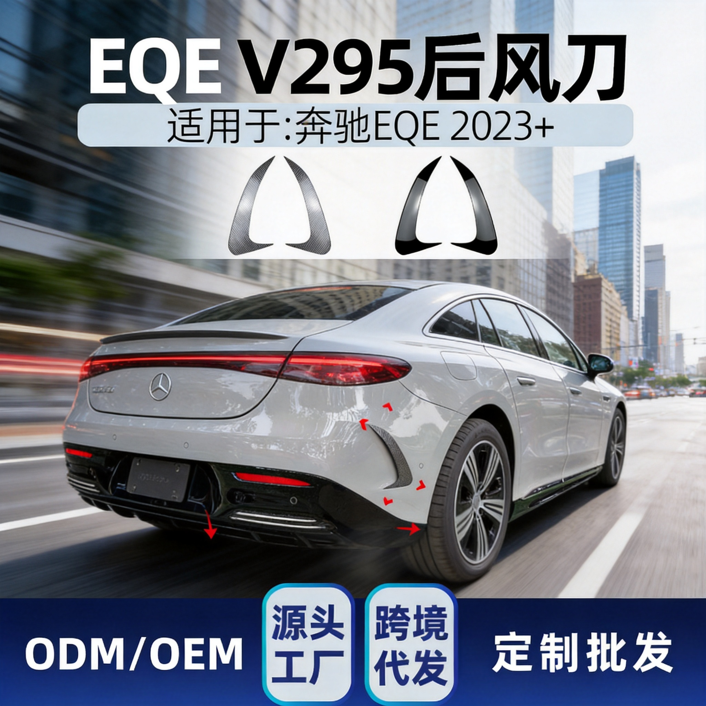

# 一、指令概述

该RPA指令依托新奇AI客户授权码（https://customer.xinqiai.cn/注册可获得试用，在个人中心获取SK开头），搭载合规国内AI图像大模型，是面向电商行业专属优化的图生图智能重绘工具，兼顾创意画面生成与商品细节无损保留，完全满足电商商用图片高精度出图要求。指令支持网络图片URL、本地图片绝对路径两种图片输入方式，以上传的产品原图为基础底图，搭配自定义文字提示词，即可完成商品图片智能重绘、场景更换、画面文案修改等操作。

指令内置多档位分辨率与主流画面比例，支持1K-4K全尺寸分辨率自由切换，同时可选多种电商通用宽高比，完美适配各大电商平台主图、详情页、营销海报的图片规格要求。模型针对电商产品做了专属算法优化，重绘过程中可牢牢锁定产品主体，完整保留产品外观造型、表面纹理、品牌logo、产品规格等全部核心细节，杜绝产品变形、细节丢失、画面模糊等常见问题，保障重绘后图片和实物产品高度一致。可轻松实现背景替换、模特更换、穿搭风格调整、展示场景重构等多种图片编辑需求，无需专业美工修图技能，即可批量产出标准化商用电商素材。单张图片处理成本0.28元，处理完成后直接输出成品图片在线URL变量，可无缝对接后续各类图片处理RPA流程。

<strong>重要限制</strong>：本指令仅支持单张图片单次重绘生成，不支持批量图片URL、批量本地路径一次性导入，批量图片重绘需要搭配循环指令逐条执行。
# 二、参数配置说明

参数名称示例/默认值参数说明授权码新奇AI授权码（字符串）填写已开通图生图接口权限的有效新奇AI授权码，用于调用国内AI图像生成接口，支持手动填写固定值，也支持变量传入。需要处理的图片URL/本地图片路径https://img.cdnfe.com/product/fancy/26ff8093-b929-43c7-93c1-b443eda36861.jpg支持单条公开无防盗链网络图片链接、单条本地图片绝对路径两种输入方式；仅支持单值变量，不支持批量链接、本地路径列表、相对路径、需要登录鉴权的私有图片链接。提示词保留产品不变，更换简约白色背景，去除画面多余文案自然语言输入重绘需求，可描述更换场景、修改文案、调整光影、更换模特等要求，建议提示词内注明保留产品主体，避免产品细节改动，支持变量传入。尺寸2K（默认）支持1K/2K/3K/4K全档位分辨率，分辨率越高画面细节越清晰，文件体积越大，可根据平台上架要求自由选择。宽高比1:1（默认）适配电商全场景比例，支持1:1正方形主图、3:4竖版详情图、16:9横版海报，覆盖电商全部常用图片尺寸。生成的变量-成品图片URLimg2img_result_url输出变量，存储重绘完成后高清成品图片在线链接，可直接被后续所有图片处理、图片下载、图片抠图等指令调用。
# 三、使用示例
适用场景商品主图优化：快速生成多版本差异化主图用于平台A/B测试，全程无损保留产品全部细节，无需线下重新实拍，快速测试不同场景主图的点击与转化数据。详情页场景配图：一键替换居家、户外、办公、节日大促等各类产品使用场景，丰富详情页展示内容，同时保证整页产品外观、尺寸、质感完全统一。模特穿搭迭代：无需重新拍摄，一键更换模特形象、调整穿搭风格适配不同消费人群，全程锁定产品主体，保证产品外观无任何变化。营销素材生产：快速生成618、双11等大促专属营销商品图，自动适配活动氛围，大幅缩短营销素材制作周期，快速响应平台活动节点。跨渠道内容适配：一键切换图片尺寸、画面比例与视觉风格，同时适配电商店铺、种草图文、短视频封面等多平台分发要求。新品测款筹备：短时间批量生成多场景、多风格新品展示图，直接用于投放测款，产品还原度高，真实反馈市场用户偏好。
## 参数配置参考

指令：图生图(国内模型)

授权码：https://customer.xinqiai.cn/注册可获得试用，在个人中心获取SK开头（自定义授权码变量）

需要处理的图片URL/本地图片路径：仅支持单条图片链接或单条本地图片路径变量

提示词：保留产品主体不变，更换高级电商极简背景，去除图片多余文字

尺寸：2K

宽高比：1:1

生成的变量-成品图片URL：img2img_result_url

# 四、执行流程

指令运行后，系统依次完成全流程自动化处理：第一步校验授权码有效性、图片地址合法性、分辨率与宽高比参数合规性；第二步将原图与自定义提示词同步上传至国内AI图像模型接口；第三步AI模型锁定产品主体，按照提示词完成场景重绘、文案去除、画面风格调整；第四步按照选定尺寸和比例输出高清成品图；最后将成品图片在线链接存入预设输出变量，全程无需人工干预操作。
# 五、运行效果

上传任意电商产品原图，输入对应提示词即可完成无损重绘，产品外观、纹理、logo全部完整保留，无变形、无模糊、无细节丢失；画面背景、文案、模特、场景完全按照提示词精准修改，画面高清干净，符合电商商用出图标准，直接获取在线图片链接，可直接用于店铺上架与二次图片加工。

示例输入提示词：背景改为在城市中飞驰

六、注意事项前往https://customer.xinqiai.cn/注册账号可领取免费试用额度，获取SK开头专属授权码；新账号存在数据延迟，未显示授权码可等待几分钟后重新登录。正式使用需保证账户余额充足、图生图接口权限已开通，授权码过期、欠费、权限不足均会导致接口调用失败。仅支持单张图片单次生成，禁止传入图片列表、数组变量、相对路径、网盘路径、移动U盘临时路径，非法参数会直接报错终止任务。支持JPG、PNG两种主流电商图片格式，单张原图大小不超过4MB；若原图产品占比过小、画面过于杂乱，会小幅影响产品主体锁定精度，建议上传主体清晰、产品占比适中的原图。提示词建议清晰明确，务必标注保留产品主体，模糊笼统的指令容易造成产品轻微变形、细节缺失；禁止输入违规、侵权类生成提示词，违规内容会直接拦截无法生成图片。分辨率越高，生成耗时越长，4K高清模式适合详情页高清大图，日常主图使用2K即可兼顾画质与生成速度。指令仅在图片成功重绘生成后扣除费用，图片读取失败、网络中断、生成失败等异常情况，不会扣除账户余额。无论使用网络图片还是本地图片作为输入，运行时必须保持网络通畅，离线状态无法调用AI图像生成接口。所有输入、输出变量均为单值文本变量，不可使用列表、数字、数组等异常变量，避免出现参数读取失败、结果无法存储的问题。
七、延伸应用批量图片重绘：搭配循环指令，批量遍历产品图片链接，统一提示词和尺寸比例，全自动批量完成商品图换背景、去文案，节省大量人工修图时间。电商全流程素材自动化：衔接图片去水印、图片高清放大指令，原图净化后再进行图生图重绘，实现原图处理→创意重绘→成品出图一站式自动化流程。店铺素材统一标准化：统一设置固定尺寸、比例与画面风格，让店铺全部商品图片视觉风格统一，提升店铺整体页面美观度。低成本素材迭代：无需反复拍摄产品实拍图，依靠原图重绘快速迭代各类营销图、场景图，极大降低产品拍摄与美工设计成本。

<Info>
  使用指令过程中遇到问题？前往 [八爪鱼RPA 开发者社区问答板块](https://rpa.bazhuayu.com/community/questions) 提问，获取官方与社区帮助。
</Info>
