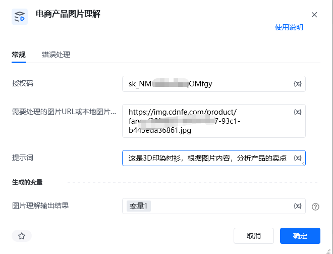

# 一、指令概述

该RPA指令依托新奇AI客户授权码（https://customer.xinqiai.cn/[https://customer.xinqiai.cn/](https://customer.xinqiai.cn/)注册可获得试用，在个人中心获取SK开头），支持传入电商产品网络图片URL或本地图片路径，搭配自定义业务提示词，即可一键完成图片全域智能理解。系统自动识别图片内产品外观、材质、尺寸、卖点、文字参数等全部图文信息，严格按照自定义提示词要求输出指定格式、指定维度的图片分析结果，无需人工看图整理信息。全面适配TEMU、亚马逊、Shein等主流跨境电商平台商品文案撰写、属性提炼、卖点总结、图片内容复盘等业务场景，单张图片处理成本约0.05元。解析完成后的完整图片理解结果会自动存入单一自定义变量，可直接对接后续所有RPA流程使用。

<strong>重要限制</strong>：本指令仅支持单张图片处理，不支持URL列表、批量链接/批量本地图片路径输入，批量图片理解需搭配循环指令逐条执行；提示词需贴合图片分析场景，过长无效提示词会影响识别输出精度。

<strong>重要限制</strong>：本指令仅支持单条图片URL处理，不支持URL列表、批量链接输入，批量图片智能解析需搭配循环指令逐条执行。
# 二、参数配置说明

参数名称示例/默认值参数说明授权码新奇AI授权码（字符串）填写已开通图片理解权限的新奇AI有效授权码，用于调用AI视觉理解接口，支持静态填写及变量传入。需要处理的图片URL/本地图片路径https://img.cdnfe.com/product/fancy/26ff8093-b929-43c7-93c1-b443eda36861.jpg支持填写单条公开可访问的产品图片网络URL，也可直接传入本地图片绝对路径；支持单值变量传入，不支持URL列表、批量本地路径、加密权限链接、需要登录才可访问的私有图片链接。提示词提炼产品核心卖点与规格参数自定义AI分析指令，可按需设置分析要求，例如提炼产品卖点、整理商品属性、翻译图片文字、总结图片全部内容等，可静态填写或变量传入，自由控制图片理解的输出方向与格式。生成的变量-图片理解输出结果imageUnderstandResult唯一输出自定义变量，用于存储AI按照提示词要求生成的完整图片理解结果，可被后续所有流程指令直接调用。
# 三、使用示例
适用场景商品文案自动生成：输入提示词要求提炼产品卖点，自动解析图片生成跨境平台可用的标题、五点描述文案；产品属性自动整理：通过提示词指定提取维度，一键梳理图片内产品颜色、尺寸、材质等完整规格参数；图片文字内容汇总：快速抓取图片内所有印刷文字、宣传话术，省去人工查看录入步骤；定制化图片分析：按需自定义提示词，灵活适配各类个性化图片解读需求，适配全品类电商图片分析场景。
## 参数配置参考

指令：电商产品图片理解

授权码：https://customer.xinqiai.cn/[https://customer.xinqiai.cn/](https://customer.xinqiai.cn/)注册可获得试用，在个人中心获取SK开头（自定义授权码变量）

需要处理的图片URL/本地图片路径：仅支持单条图片链接或单条本地图片路径变量

提示词：提炼产品核心卖点与规格参数

生成的变量-图片理解输出结果：imageUnderstandResult

# 四、执行流程

配置完成后运行指令，系统自动携带授权码、图片地址、自定义提示词请求新奇AI视觉理解接口，自动完成图片加载、画面与文字智能识别、按照提示词定向分析、内容规整输出全流程处理，全程无需人工干预。处理成功后，将标准化的图片理解结果统一存入指定输出变量，可直接供后续RPA流程调用。
# 五、运行效果

输入产品网络图片链接或本地图片路径，搭配自定义提示词，即可精准输出符合指令要求的图片分析内容，结果条理清晰、贴合跨境电商运营需求，无需人工二次修改，完美适配电商自动化运营全流程。
六、注意事项授权码与账户权限要求：https://customer.xinqiai.cn/注册可获得试用，在个人中心获取SK开头授权码；刚注册账户存在数据同步延迟，未显示授权码可稍等几分钟重新登录或联系客服。投入生产运行前需保证账户余额充足、图片理解接口权限正常，授权码过期、欠费、权限不足均会导致系统内部异常，接口调用失败。图片链接输入规范：严格适配单URL处理规则，禁止传入URL列表、数组变量、本地图片路径、需要登录/加密才能访问的图片链接，违规输入会直接触发处理报错，任务停止运行。图片格式与大小限制：支持网络图片与本地图片，兼容JPG、PNG主流图片格式，单张图片大小不超过4MB，超出格式或大小限制会导致图片解析失败；图片模糊、反光严重、画面遮挡过多，会降低图片理解精准度。计费规则说明：指令按成功完成图片解析的有效张数计费，单次完整解析成功即扣除对应费用；网络超时、识别失败等未完成全流程解析的情况不扣费，测试运行建议使用测试图片链接，避免无效扣费。网络环境要求：运行过程需保持设备网络通畅，网络超时、网络中断、代理异常都会导致接口请求失败，出现系统内部异常报错，此类网络问题不会重复扣费，排查网络后可重新执行即可。变量配置规范：输入变量不可使用列表等异常变量类型，变量格式错误会导致解析结果无法正常存储，后续指令无法调取数据。
七、延伸应用批量图片智能解析：搭配RPA循环指令，遍历图片URL列表，逐条调用本指令完成大批量产品图片自动解析，实现海量商品图片无人值守信息采集。电商上架全流程自动化：对接商品上架指令，将解析出的产品卖点、属性信息自动填充至商品后台对应输入框，实现图片识别→文案生成→商品上架一站式自动化流程。多指令联动图文处理：可衔接白底图生成、图片翻译指令，先完成图片内容理解，再按需进行图片修图、图文翻译，打造从图片识别到图片美化、图文本地化的完整电商图片自动化流水线。
## 八、首次使用

首次使用时，会报错提示“Python包未找到”，点击“立刻安装即可”。如下图操作：

<Info>
  使用指令过程中遇到问题？前往 [八爪鱼RPA 开发者社区问答板块](https://rpa.bazhuayu.com/community/questions) 提问，获取官方与社区帮助。
</Info>
