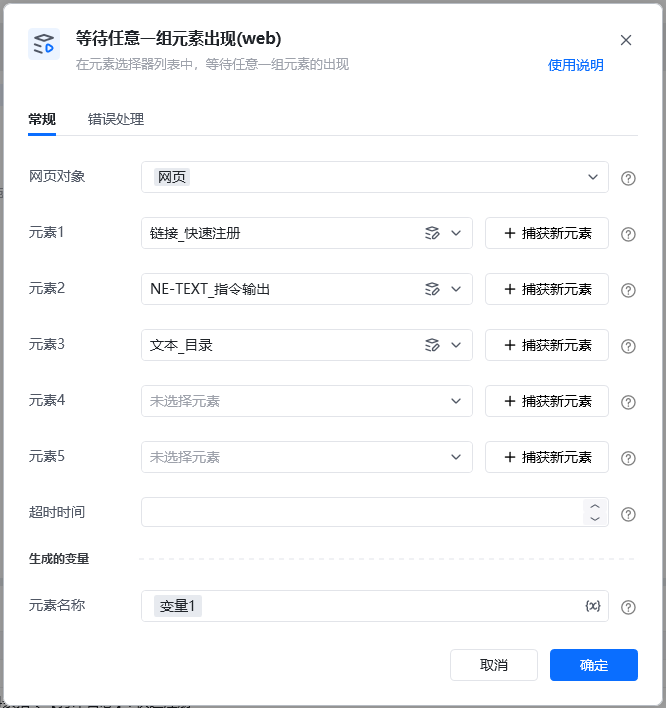
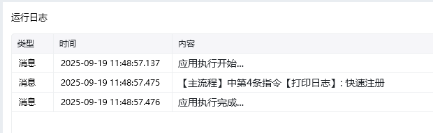
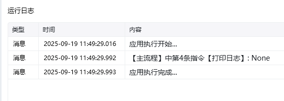

## 输入

<strong>网页对象：</strong>网页对象

<strong>元素1：</strong>元素1

<strong>元素2：</strong>元素2

<strong>元素3：</strong>元素3，非必填

<strong>元素4：</strong>元素4，非必填

<strong>元素5：</strong>元素5，非必填

<strong>超时时间(S)：</strong>等待元素出现的超时时间，单位：秒

## 输出

<strong>元素名称：</strong>出现的元素的选择器名称，超过时间没有匹配则返回None

<Info>
  使用指令过程中遇到问题？前往 [八爪鱼RPA 开发者社区问答板块](https://rpa.bazhuayu.com/community/questions) 提问，获取官方与社区帮助。
</Info>
