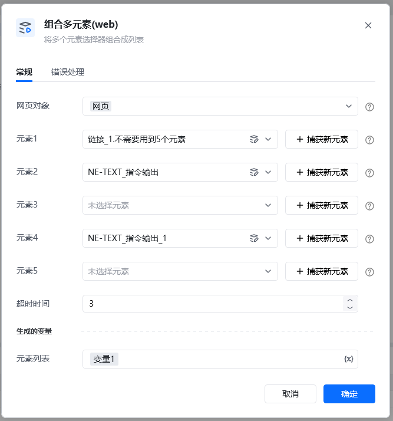
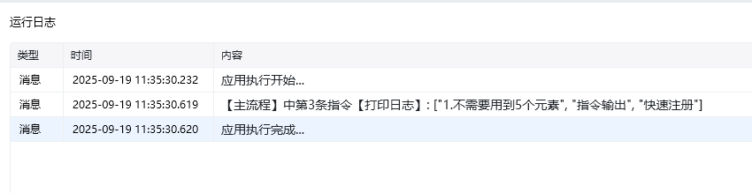
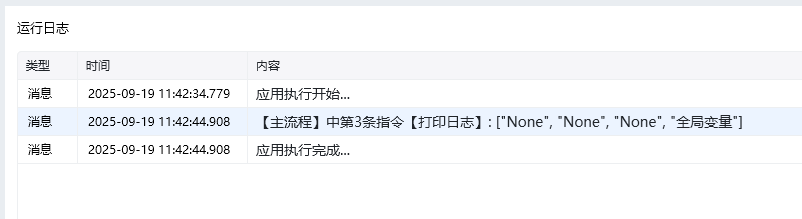

## 参数配置
## 指令输入
### <strong>元素1：</strong>元素1

<strong>元素2：</strong>元素2

<strong>元素3：</strong>元素3

<strong>元素4：</strong>元素4

<strong>元素5：</strong>元素5

超时时间：设置每个元素等待超时时间，多少秒

元素1和元素2必填，其他选填

<strong>元素列表：</strong>匹配到元素返回名称列表，如果没匹配到元素则返回的是None

下图示例，3个元素成功匹配到

比如返回示例，4个元素里面有3个都没有匹配到返回None，第4个匹配到了

<Info>
  使用指令过程中遇到问题？前往 [八爪鱼RPA 开发者社区问答板块](https://rpa.bazhuayu.com/community/questions) 提问，获取官方与社区帮助。
</Info>
