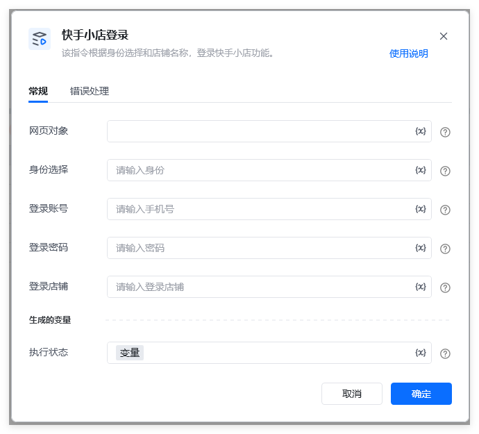
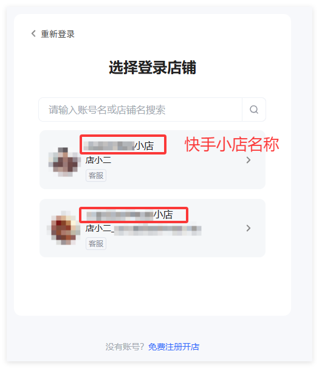
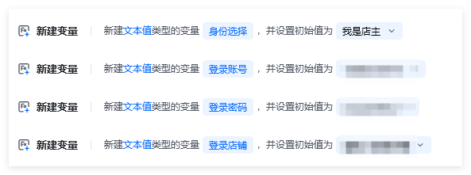
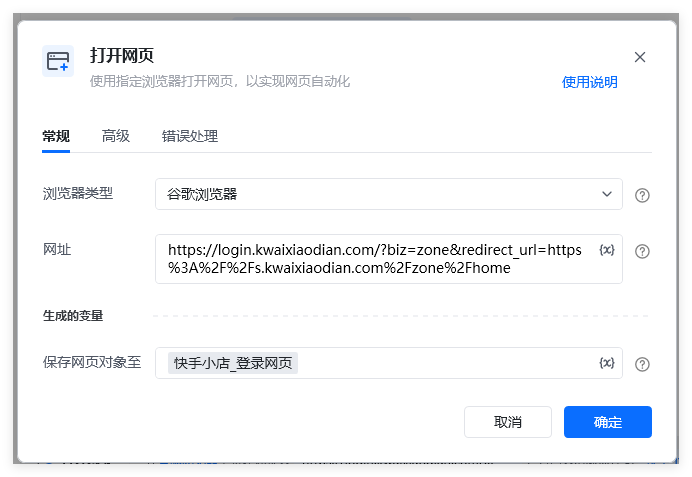
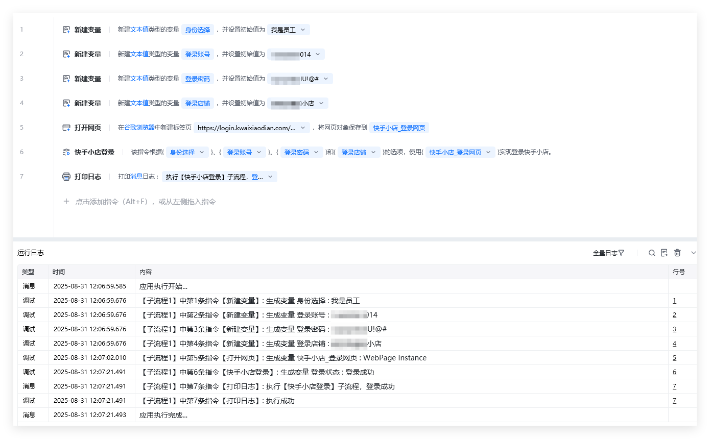
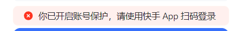
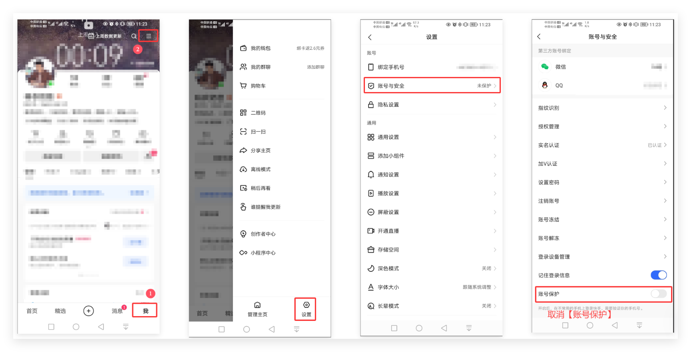

## 指令描述

该指令根据<strong>身份选择</strong>￱、￰<strong>登录账号</strong>￱、<strong>￰登录密码</strong>￱和<strong>￰登录店铺</strong>￱的选项，使用<strong>网页对象￱</strong>实现登录快手小店。

## 参数配置
### 指令输入

<strong>网页对象: </strong>网页对象，使用【打开网页】或者【获取已打开的网页对象】指令获取快手小店登录页面的返回值（生成变量）

<strong>身份选择: </strong>字符串，快手登录的时候需要选择身份（店主或者员工），必须是【我是店主】或者【我是员工】

<strong>登录账号: </strong>字符串，账号

<strong>登录密码: </strong>字符串，密码

<strong>登录店铺：</strong>字符串 ，需要登录的快手小店名称。

如果只有一个店铺，可为空。

如有账号名下有多个店铺，登录过程需要选择指定具体店铺名称，如下图所示：

### 指令输出

<strong>执行状态：</strong>指令执行结果，用于指示和判断指令执行结果，返回值如下。登录成功返回：登录成功登录失败返回：登录失败，XXXX

备注：XXXX，可能是【账号密码不符】、【登录店铺未找到】等提示。
## 流程说明

1、创建和赋值相关变量：

2、使用快手小店的网页（如下图所示）【 https://login.kwaixiaodian.com/?biz=zone&redirect_url=https%3A%2F%2Fs.kwaixiaodian.com%2Fzone%2Fhome 】作为参数，

使用【打开网页】指令打开快手小店登录网页，

3、示例流程代码和运行结果，如下图所示：

## 注意事项
### 1.快手小店登录中会出现账号保护的提示

解决方法：在 <strong>手机快手APP </strong>中 【我】->【设置】->【账号与安全】->【账号保护】中关闭账号保护功能，如下图所示操作：

<Info>
  使用指令过程中遇到问题？前往 [八爪鱼RPA 开发者社区问答板块](https://rpa.bazhuayu.com/community/questions) 提问，获取官方与社区帮助。
</Info>
