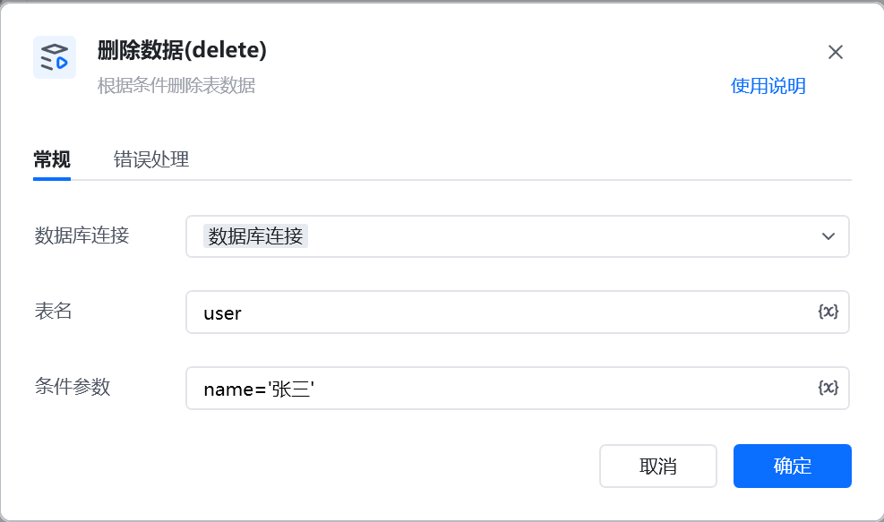

示例：DELETE FROM  `user_info`
WHERE `id` = 1001  AND `status` = 'deleted';

DELETE FROM  表名
WHERE 条件参数;

<Info>
  使用指令过程中遇到问题？前往 [八爪鱼RPA 开发者社区问答板块](https://rpa.bazhuayu.com/community/questions) 提问，获取官方与社区帮助。
</Info>
