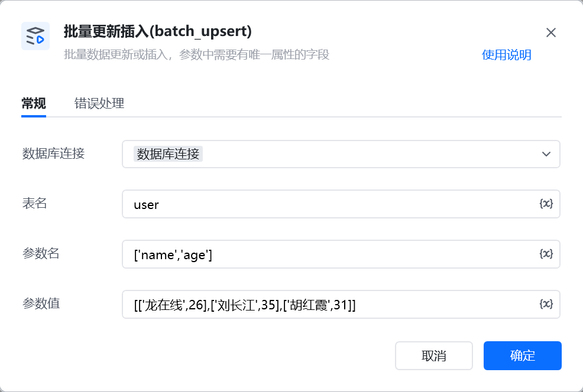

示例：INSERT INTO `user_order` (`id`,`order`,`price`,`remark`)
VALUES (1001,'ORD-2025',99.9,NULL),(1002,'ORD-2026',199.9,'测试备注')
ON DUPLICATE KEY UPDATE `id`=VALUES(`id`),`order`=VALUES(`order`),`price`=VALUES(`price`),`remark`=VALUES(`remark`);

INSERT INTO 表名 (参数名)
VALUES 参数值解析
ON DUPLICATE KEY UPDATE 参数名解析;

<Info>
  使用指令过程中遇到问题？前往 [八爪鱼RPA 开发者社区问答板块](https://rpa.bazhuayu.com/community/questions) 提问，获取官方与社区帮助。
</Info>
