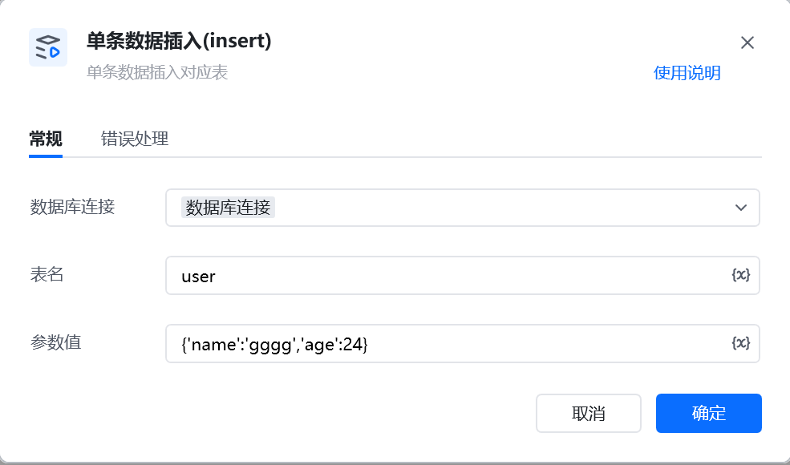

示例：INSERT INTO  `user` (`id`, `username`) VALUES (1, 'zhangsan');

INSERT INTO  表名 (参数解析) VALUES (参数解析);

<Info>
  使用指令过程中遇到问题？前往 [八爪鱼RPA 开发者社区问答板块](https://rpa.bazhuayu.com/community/questions) 提问，获取官方与社区帮助。
</Info>
