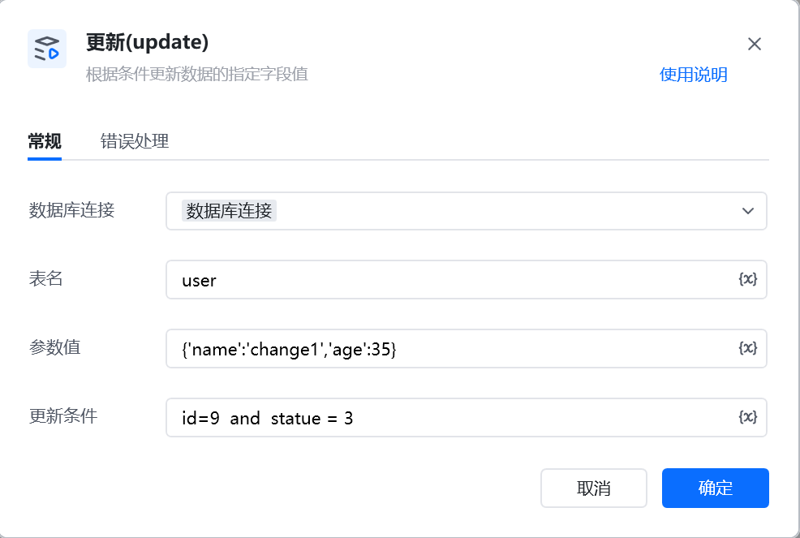

示例：UPDATE `user_info` SET `status`='active',`2025_flag`=1,`order`='ORD-1001' WHERE user_id=2 AND `status`!='deleted';

UPDATE 表名 SET 参数解析 WHERE 更新条件;

<Info>
  使用指令过程中遇到问题？前往 [八爪鱼RPA 开发者社区问答板块](https://rpa.bazhuayu.com/community/questions) 提问，获取官方与社区帮助。
</Info>
