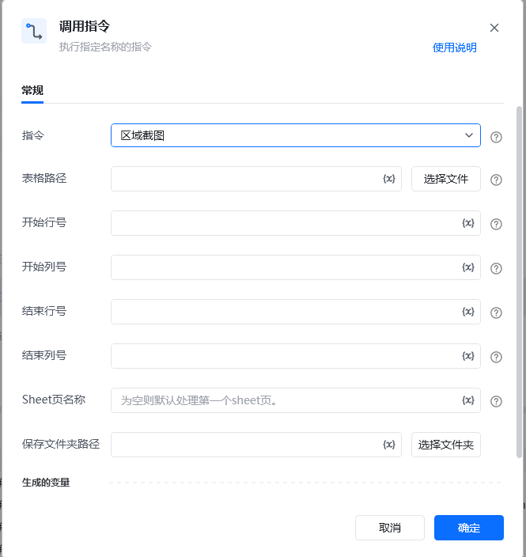

## <strong>一、指令概述</strong>

该 RPA 指令用于对 <strong>Excel 表格的指定区域</strong> 进行截图操作，支持自定义截图的行列范围、目标 Sheet 页，并将截图保存至指定文件夹；同时会生成包含截图完整路径的变量，便于后续流程（如邮件发送、文档插入等）调用截图。（此指令已不维护，并且在4月1日下架）
## <strong>二、调用参数配置示意</strong>

参数名称示例 / 默认值说明指令区域截图固定选择 “区域截图”，表示执行 Excel 区域截图操作。表格路径（如 “C:\Data\ 销售报表.xlsx”）输入要截图的 Excel 文件路径；可点击「选择文件」按钮选取本地文件，支持变量（界面显示 “{x}” 标识）。开始行号（如 “2”）输入截图区域的起始行号（整数，对应 Excel 中行的编号），支持变量。开始列号（如 “A” 或 “1”）输入截图区域的起始列号（支持数字或字母，如 “A” 对应 Excel 第一列），支持变量。结束行号（如 “10”）输入截图区域的结束行号（整数，需大于等于 “开始行号”），支持变量。结束列号（如 “E” 或 “5”）输入截图区域的结束列号（支持数字或字母，需对应 “开始列号” 的逻辑范围），支持变量。Sheet 页名称（如 “2025 年 9 月”，或默认 “第一个 sheet 页”）输入要截图的 Sheet 页名称；不填则默认处理 Excel 的第一个 sheet 页，支持变量。保存文件夹路径（如 “D:\ 报表截图”）输入截图要保存的文件夹路径；可点击「选择文件夹」按钮选取本地文件夹，支持变量。生成的变量 - 截图路径变量（自定义变量名）存储截图的完整文件路径（含文件名和扩展名），需配置为自定义变量，后续流程可调用该变量使用截图，支持变量。
## <strong>三、使用示例（销售报表区域截图场景）</strong>
### <strong>场景：对 “C:\Data\ 销售报表.xlsx” 中 “2025 年 9 月” Sheet 页的 A2 至 E10 区域 截图，保存到 “D:\ 报表截图” 文件夹，并将截图路径存入变量 salesReportScreenshot。</strong>
#### <strong>参数配置：</strong>

• 指令：区域截图

• 表格路径：C:\Data\销售报表.xlsx（或通过「选择文件」选取）

• 开始行号：2

• 开始列号：A

• 结束行号：10

• 结束列号：E

• Sheet 页名称：2025年9月

• 保存文件夹路径：D:\报表截图（或通过「选择文件夹」选取）

• 截图路径：salesReportScreenshot（自定义变量，需提前创建或直接命名）
#### <strong>执行流程：</strong>

调用该 RPA 指令，按上述参数配置后执行，RPA 会自动打开目标 Excel 文件，对指定 Sheet 页的 A2 - E10 区域进行截图，将截图保存至 “D:\ 报表截图” 文件夹，并把截图的完整路径赋值给变量 salesReportScreenshot。
## <strong>四、运行效果</strong>

指定文件夹（如 “D:\ 报表截图”）中会生成 Excel 区域的截图文件（通常为 PNG 等图片格式，依 RPA 工具默认设置）；同时，“截图路径” 变量会被赋值为该截图的完整路径（如 D:\报表截图\screenshot_20250922.png）。

【此处插入 “截图文件保存效果” 及 “变量赋值后调试界面效果” 截图】
## <strong>五、注意事项</strong>

1. <strong>表格路径有效性</strong>：需确保 “表格路径” 指向的 Excel 文件<strong>真实存在</strong>，否则指令会因 “文件不存在” 执行失败。

2. <strong>区域行列号合理性</strong>：“开始 / 结束行号”“开始 / 结束列号” 需对应 Excel 中真实存在的区域（行号、列号需在有效范围内，且结束行号≥开始行号、结束列号对应范围合理），否则可能截图空白区域或报错。

3. <strong>文件夹可写入性</strong>：“保存文件夹路径” 需指向具有<strong>写入权限</strong>的文件夹，否则截图无法保存。

4. <strong>Sheet 页存在性</strong>：若指定了 “Sheet 页名称”，需确保该 Sheet 在目标 Excel 中存在，否则指令报错。

5. <strong>变量配置规范性</strong>：“截图路径” 需配置为合法的变量（如提前定义变量名、确保变量类型为 “文本型” 存储路径），否则无法正确存储截图路径。
## <strong>六、延伸应用</strong>

可结合 RPA 的「邮件发送」指令，将 “截图路径” 变量对应的图片作为邮件附件发送；或结合「Word 文档编辑」指令，将截图插入到报告类 Word 文档中，实现 “Excel 数据可视化 → 截图 → 跨应用使用” 的自动化闭环。

<Info>
  使用指令过程中遇到问题？前往 [八爪鱼RPA 开发者社区问答板块](https://rpa.bazhuayu.com/community/questions) 提问，获取官方与社区帮助。
</Info>
