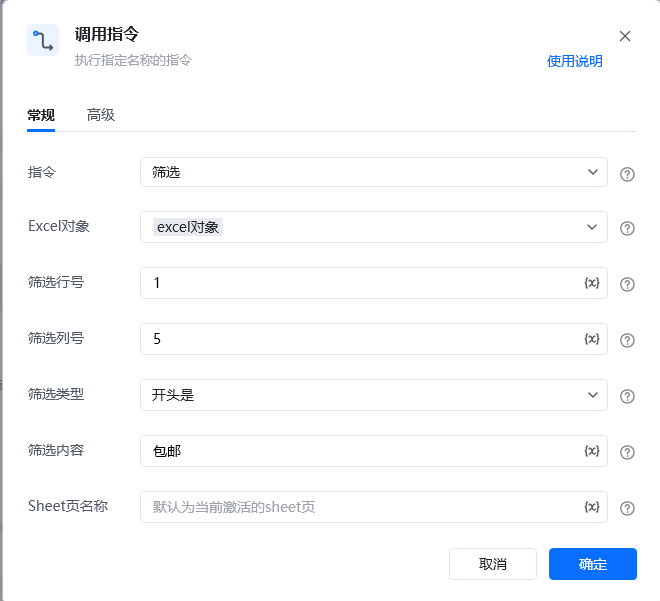

## <strong>一、指令概述</strong>

该 RPA 指令用于对 Excel 表格数据执行<strong>筛选操作</strong>，支持<strong>单条件筛选</strong>或通过「高级」标签配置<strong>多条件组合筛选</strong>，可灵活设置筛选的行、列、匹配规则及目标 Sheet 页等参数，实现精准数据筛选。
## <strong>二、调用参数配置示意</strong>
### <strong>（一）「常规」标签参数</strong>

参数名称示例 / 默认值说明指令筛选固定选择 “筛选”，表示执行筛选指令。Excel 对象excel对象选择要操作的 Excel 实例对象（需提前通过其他指令创建 / 获取 Excel 对象）。筛选行号1指定筛选条件所在的行号（如表头行），支持变量（界面显示 “{x}” 标识）。筛选列号（空，可填 “A” 或 “1” 等）输入要筛选的列的编号（支持数字 / 字母，如 “A” 对应 Excel 第一列），支持变量。筛选类型开头是选择筛选的匹配规则，下拉列表含：等于、不等于、包含、不包含、开头是、开头不是、结尾是、结尾不是、大于、大于或等于、小于、小于或等于。筛选内容（空，可填 “手机”“100” 等）输入筛选的目标内容（如文本 “手机”、数值 “100”），支持变量。Sheet 页名称默认为当前激活的sheet页指定要筛选的 Sheet 页名称；不填则使用当前激活的 Sheet 页，支持变量。
### <strong>（二）「高级」标签参数（多条件筛选专用）</strong>

参数名称示例 / 默认值说明筛选关系不使用条件2 / 且 / 或选择多条件的逻辑关系：- 「不使用条件 2」：仅执行单条件筛选；- 「且」：多条件同时满足才筛选；- 「或」：多条件满足其一就筛选。筛选类型 2（空，或下拉选 “等于” 等）第二个筛选条件的匹配规则，下拉选项同「常规」标签的 “筛选类型”。筛选内容 2（空，可填目标内容）第二个筛选条件的目标内容，支持变量。
## <strong>三、使用示例（单条件筛选场景）</strong>
### <strong>场景：筛选 “销售数据.xlsx” 中，「产品」列（A 列）“开头是‘手机’” 的行（表头在第 1 行）。</strong>
#### <strong>参数配置：</strong>

• 指令：筛选

• Excel 对象：选择已打开的 “销售数据.xlsx” 对应的 Excel 对象

• 筛选行号：1（表头行）

• 筛选列号：A（「产品」列对应的列号）

• 筛选类型：开头是

• 筛选内容：手机

• Sheet 页名称：销售明细（若目标 Sheet 为 “销售明细”，否则留空用当前激活页）
#### <strong>执行流程：</strong>

调用该 RPA 指令，按上述参数配置后执行，Excel 会自动对 “销售明细” Sheet 页的 A 列，筛选出 ** 开头为 “手机”** 的行。
## <strong>四、运行效果</strong>

Excel 表格中仅显示「产品」列开头为 “手机” 的行，其他行暂时隐藏（可通过 Excel 「取消筛选」功能恢复全部数据）。

【此处插入 “筛选后表格效果” 截图】
## <strong>五、注意事项</strong>

1. <strong>Excel 对象有效性</strong>：需提前正确创建 / 获取 Excel 对象，否则指令会因 “对象不存在” 执行失败。

2. <strong>列号准确性</strong>：筛选列号需与 Excel 实际列对应（如 “A” 对应第一列），否则会筛选错误列或无结果。

3. <strong>内容与类型匹配</strong>：“筛选类型” 需与 “筛选内容” 逻辑匹配（如 “大于 / 小于” 适合数值，“开头是 / 包含” 适合文本）。

4. <strong>多条件逻辑一致性</strong>：使用多条件筛选时，“筛选关系” 需与 “筛选类型 2”“筛选内容 2” 配套，避免逻辑冲突（如 “且” 关系下两个条件需同时合理）。

5. <strong>Sheet 页存在性</strong>：若指定了 Sheet 页名称，需确保该 Sheet 存在，否则指令报错。
## <strong>六、延伸应用</strong>

可结合 RPA 的「循环」「数据写入」等指令，将筛选出的数据<strong>批量导出到新表格</strong>、<strong>生成统计报表</strong>，或触发后续自动化动作（如给符合条件的数据关联 “发送通知”“更新系统” 等操作）。

<Info>
  使用指令过程中遇到问题？前往 [八爪鱼RPA 开发者社区问答板块](https://rpa.bazhuayu.com/community/questions) 提问，获取官方与社区帮助。
</Info>
