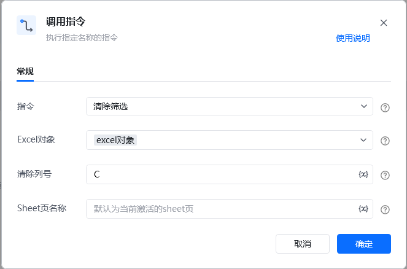

## <strong>一、指令概述</strong>

该 RPA 指令用于<strong>清除 Excel 表格中的筛选器</strong>，支持清除指定列的筛选器，或默认清除所有列的筛选器，使表格恢复显示全部数据。
## <strong>二、调用参数配置示意</strong>

参数名称示例 / 默认值说明指令清除筛选固定选择 “清除筛选”，表示执行清除筛选的操作。Excel 对象excel对象选择要操作的 Excel 实例对象（需提前通过其他指令创建 / 获取 Excel 对象）。清除列号默认清除所有筛选器输入待清除筛选器的列号（支持数字 / 字母，如 “A”“1”）；不填则默认清除所有列的筛选器，支持变量（界面显示 “{x}” 标识）。Sheet 页名称默认为当前激活的sheet页指定要清除筛选的 Sheet 页名称；不填则使用当前激活的 Sheet 页，支持变量。
## <strong>三、使用示例（清除指定列筛选场景）</strong>
### <strong>场景：清除 “销售数据.xlsx” 中「产品」列（A 列）的筛选器（目标 Sheet 为 “销售明细”）。</strong>
#### <strong>参数配置：</strong>

• 指令：清除筛选

• Excel 对象：选择已打开的 “销售数据.xlsx” 对应的 Excel 对象

• 清除列号：A（「产品」列对应的列号）

• Sheet 页名称：销售明细
#### <strong>执行流程：</strong>

调用该 RPA 指令，按上述参数配置后执行，Excel 会自动清除 “销售明细” Sheet 页中 A 列的筛选器，该列数据恢复全部显示。
## <strong>四、运行效果</strong>

Excel 表格中被筛选隐藏的行重新显示，目标列（或所有列）的筛选标记（如列头的筛选箭头状态）恢复为 “未筛选” 状态。

【此处插入 “清除筛选后表格效果” 截图】
## <strong>五、注意事项</strong>

1. <strong>Excel 对象有效性</strong>：需提前正确创建 / 获取 Excel 对象，否则指令会因 “对象不存在” 执行失败。

2. <strong>列号准确性</strong>：若指定 “清除列号”，需与 Excel 实际列对应（如 “A” 对应第一列），否则可能无法精准清除目标列筛选。

3. <strong>Sheet 页存在性</strong>：若指定了 Sheet 页名称，需确保该 Sheet 存在，否则指令报错。

4. <strong>筛选器存在性</strong>：若目标列 / Sheet 本就无筛选器，指令执行后无视觉变化（属于 “正常清除”，不影响数据）。
## <strong>六、延伸应用</strong>

可结合 RPA 的「筛选」指令与「清除筛选」指令，实现 “先筛选提取目标数据 → 处理数据 → 清除筛选恢复表格” 的自动化流程，保证后续操作时表格数据的完整性。

<Info>
  使用指令过程中遇到问题？前往 [八爪鱼RPA 开发者社区问答板块](https://rpa.bazhuayu.com/community/questions) 提问，获取官方与社区帮助。
</Info>
