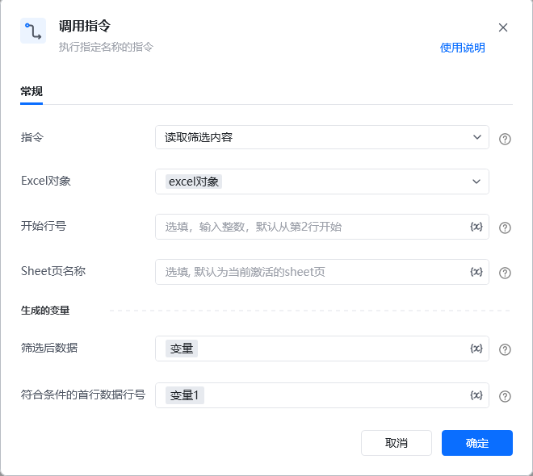

## <strong>一、指令概述</strong>

该 RPA 指令用于<strong>读取 Excel 表格中已筛选后的数据</strong>，支持指定开始行号、Sheet 页，将筛选后的数据及符合条件的首行数据行号分别存储到变量中，为后续数据处理（如统计、写入其他文档等）提供基础。
## <strong>二、调用参数配置示意</strong>

参数名称示例 / 默认值说明指令读取筛选内容固定选择 “读取筛选内容”，表示执行读取筛选后数据的操作。Excel 对象excel对象选择要操作的 Excel 实例对象（需提前通过其他指令创建 / 获取 Excel 对象）。开始行号（空，或填 “3” 等整数）选填，输入整数指定读取数据的起始行号；不填则默认从第 2 行开始读取，支持变量（界面显示 “{x}” 标识）。Sheet 页名称（空，或填 “销售明细”）选填，指定要读取数据的 Sheet 页名称；不填则使用当前激活的 Sheet 页，支持变量。生成的变量 - 筛选后数据变量（自定义变量名）存储筛选后的数据内容，需配置为自定义变量（后续流程可调用该变量使用筛选后数据），支持变量。生成的变量 - 符合条件的首行数据行号变量1（自定义变量名）存储筛选后符合条件的首行数据所在的行号，需配置为自定义变量，支持变量。
## <strong>三、使用示例（读取销售数据筛选后内容场景）</strong>
### <strong>场景：读取 “销售数据.xlsx” 中已筛选后的「销售明细」Sheet 数据（从第 2 行开始读取），并将结果存入变量 salesData，首行号存入 firstRowNum。</strong>
#### <strong>参数配置：</strong>

• 指令：读取筛选内容

• Excel 对象：选择已打开的 “销售数据.xlsx” 对应的 Excel 对象

• 开始行号：（留空，使用默认 “从第 2 行开始”）

• Sheet 页名称：销售明细

• 筛选后数据：salesData（自定义变量，需提前创建或直接输入命名）

• 符合条件的首行数据行号：firstRowNum（自定义变量，需提前创建或直接输入命名）
#### <strong>执行流程：</strong>

调用该 RPA 指令，按上述参数配置后执行，Excel 会读取 “销售明细” Sheet 中已筛选后的数据（从第 2 行起），并将数据存入 salesData，符合条件的首行数据行号存入 firstRowNum。
## <strong>四、运行效果</strong>

指定的变量（如 salesData）会被赋值为筛选后的数据集合（格式通常为列表 / 表格型数据，具体依 RPA 工具数据结构而定），firstRowNum 会被赋值为筛选后首行数据在 Excel 中的行号。

【此处插入 “变量赋值后效果（如调试窗口查看变量）” 截图】
## <strong>五、注意事项</strong>

1. <strong>Excel 对象有效性</strong>：需提前正确创建 / 获取 Excel 对象，且该 Excel 中存在已执行的筛选操作，否则指令可能因 “对象不存在” 或 “无筛选数据” 导致异常。

2. <strong>行号与 Sheet 页准确性</strong>：若指定 “开始行号” 或 “Sheet 页名称”，需确保行号在有效数据范围内、Sheet 页存在，否则可能读取不到数据或读取错误。

3. <strong>变量配置规范性</strong>：“筛选后数据” 和 “符合条件的首行数据行号” 需配置为合法的变量（如提前定义变量名、确保变量类型匹配），否则无法正确存储结果。

4. <strong>筛选前置条件</strong>：执行该指令前，Excel 表格需<strong>已完成筛选操作</strong>（即存在筛选后的数据状态），否则读取结果可能为全部数据或无数据。
## <strong>六、延伸应用</strong>

可结合 RPA 的「数据处理」「循环」「写入文件」等指令，对 “筛选后数据” 变量进行二次加工（如统计销售额、提取特定字段），或把数据写入报表、数据库，实现 “筛选 - 读取 - 分析 / 存储” 的自动化闭环。

<Info>
  使用指令过程中遇到问题？前往 [八爪鱼RPA 开发者社区问答板块](https://rpa.bazhuayu.com/community/questions) 提问，获取官方与社区帮助。
</Info>
