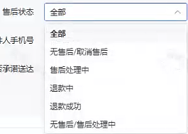
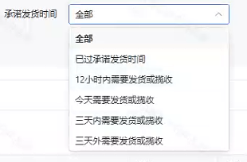

### 一、指令说明描述：

该指令实现了订单的查询，并进行批量导出(批量下载导出:两次提交时间不得小于5分钟）

### 二、指令参数说明：
### 配置说明

输入网页对象：传入已加载的 “发货管理 - 订单查询” 页面对象。

订单状态：文本值，输入与平台一致的订单状态名称（如 “已发货”“待发货”）

售后状态：文本值，输入与平台一致的售后状态名称（如 “无售后”“退款中”）

具体日期类型：单选框，例如：最近 24h 内、最近 7 天内、最近 30 天内、最近 90 天内、自定义

开始时间：自定义日期范围的开始时间，时间格式为 YYYY-MM-DD（仅 “具体日期类型” 为 “自定义” 时需填写）

结束时间：自定义日期范围的结束时间，时间格式为 YYYY-MM-DD（仅 “具体日期类型” 为 “自定义” 时需填写）

报表类型：单选框，例如：对账报表、自定义报表

自定义路径：文件存放地址
### 高级：

超时状态：字符串，输入与平台一致的超时状态名称

是否承诺送达：字符串，输入与平台一致的状态名称

承诺发货时间：文本值，输入与平台一致的时间范围名称

自定义文件名称：文本值，输入文件名称，不需要文件名后缀
### 输出：

生成文件路径：文本值，输出文件完整路径

<Info>
  使用指令过程中遇到问题？前往 [八爪鱼RPA 开发者社区问答板块](https://rpa.bazhuayu.com/community/questions) 提问，获取官方与社区帮助。
</Info>
