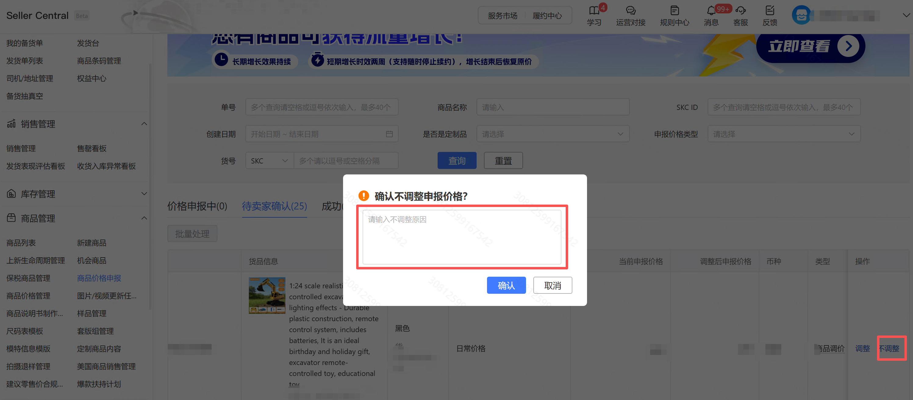
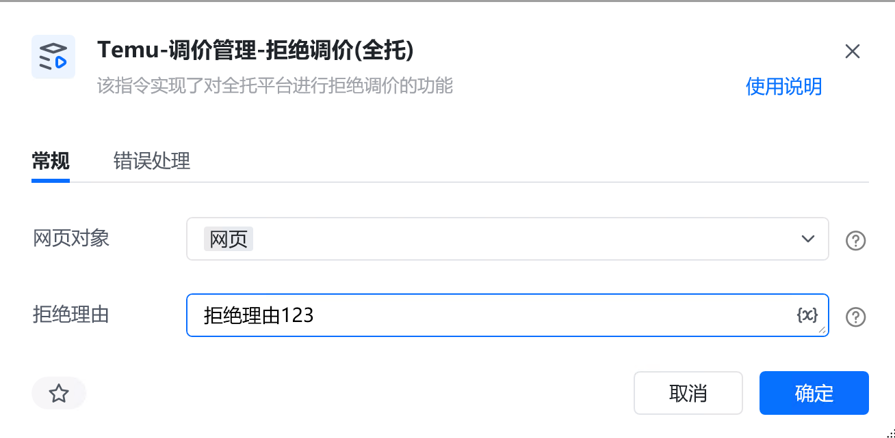

# 描述

该指令实现了对全托平台进行拒绝调价的功能

# 配置说明
## 输入

<strong>网页对象:</strong>

任意一个已登录Temu后台的网页对象

<strong>拒绝理由:</strong>

填写一个拒绝理由（拒绝理由统一）
## 输出

<strong>文件路径：</strong>

该指令无内容输出
# 使用示例

# 运行结果

该指令无内容输出

<Info>
  使用指令过程中遇到问题？前往 [八爪鱼RPA 开发者社区问答板块](https://rpa.bazhuayu.com/community/questions) 提问，获取官方与社区帮助。
</Info>
