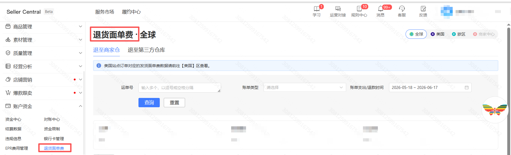

## <strong>一、指令概述</strong>

本指令用于 Temu 商家后台「账户资金」模块，自动筛选指定站点、退货类型、时间区间的退货面单费用数据，一键导出 Excel表格

## <strong>二、输入参数明细</strong>、参数名称控件类型填写规则 & 可选值参数作用站点输入框美国、欧区商家中心、筛选目标业务站点，文字需与后台站点名称完全匹配退货类型单选下拉框1. 退至商家仓2. 退至第三方仓库区分退货入库仓库类型，分别导出两种渠道的面单扣费明细开始日期输入框格式固定YYYY-MM-DD起始日期结束日期输入框格式固定YYYY-MM-DD截止日期文件路径文件夹选择框本地文件夹绝对路径导出报表的本地保存根目录文件名称输入框自定义名称，无需加.xlsx后缀导出 Excel 文件自定义命名，支持拼接日期、店铺变量区分报表输出路径输出参数自动回填完整文件地址输出保存后的文件全路径，可直接传给读取 Excel、上传文件指令
## <strong>三、实操配置示例</strong>
### <strong>场景 1：导出加拿大站当月商家仓退货面单费</strong>

•站点：全球

•退货类型：退至商家仓

•开始日期：2026-06-01

•结束日期：2026-06-30

•文件路径：D:\Temu财务对账\退货费用

•文件名称：加拿大站_商家仓_6月退货面单费

<Info>
  使用指令过程中遇到问题？前往 [八爪鱼RPA 开发者社区问答板块](https://rpa.bazhuayu.com/community/questions) 提问，获取官方与社区帮助。
</Info>
