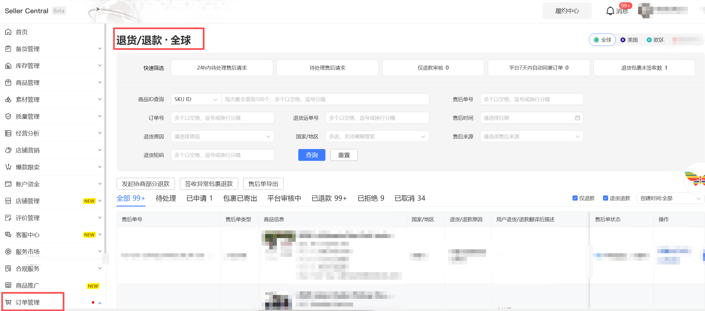

## 一、指令概述

本指令适配 Temu 商家后台「订单管理 - 退货退款」页面，支持多维度筛选售后单据，自动导出售后明细 Excel 文件，用于售后对账、退款核算、售后工单统计、客诉复盘等财务 / 运营场景。

## 二、输入参数明细参数名称控件类型可选值 / 填写规则参数作用说明站点单选下拉框全球、欧区、美国筛选目标业务站点，限定导出对应区域售后单创建日期范围单选下拉框今天、昨天、本周、上周、本月、上月、自定义快速选择统计周期；选择「自定义」时，下方起止日期输入框激活开始日期输入框格式固定YYYY-MM-DD售后单创建起始日期，仅日期范围 = 自定义时生效结束日期输入框格式固定YYYY-MM-DD售后单创建截止日期，仅日期范围 = 自定义时生效售后单类型单选下拉框全部、退货退款、仅退款区分售后业务类型，分别导出退货类、纯退款类单据售后单状态单选下拉框全部、进行中、已退款、已取消、已拒绝按售后工单处理状态过滤数据国家_地区文本输入框与网页地区名称完全一致，数据类型：文本值列表精细化筛选买家所属国家，缩小导出数据范围文件保存路径文件夹选择框本地文件夹绝对路径导出报表本地存储根目录自定义文件名称输入框自定义文件名，无需带.xlsx后缀导出 Excel 文件命名，支持变量拼接日期、站点区分报表生成的变量【文件路径】输出变量自定义变量名返回导出文件完整本地路径，可直接传给读取 Excel、上传钉钉指令
## 三、实操配置示例

<Info>
  使用指令过程中遇到问题？前往 [八爪鱼RPA 开发者社区问答板块](https://rpa.bazhuayu.com/community/questions) 提问，获取官方与社区帮助。
</Info>
