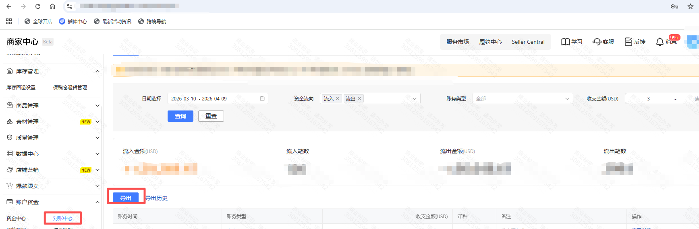
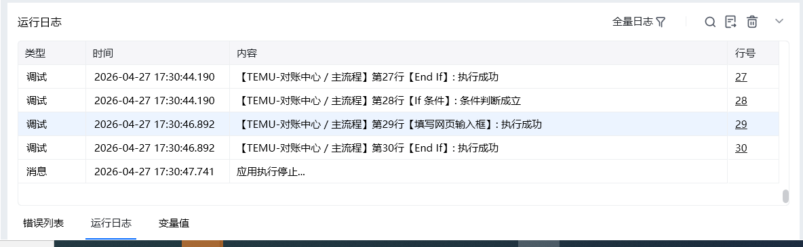

一、指令概述

该指令用于在 TEMU 卖家中心的「对账中心」页面，自动下载财务明细报表，支持按日期范围、资金流向、账务类型、收支金额区间多维度筛选数据，并将报表保存至指定路径。

二、核心参数配置参数名称说明输入格式 / 规则网页已登录TEMU卖家中心的浏览器网页对象必填；开始日期报表数据的起始日期必填；格式为YYYY-MM-DD，需早于或等于结束日期结束日期报表数据的结束日期必填；格式为YYYY-MM-DD，需晚于或等于开始日期保存文件夹报表文件的本地保存目录必填保存文件名导出报表的文件名称（不含后缀）选填；留空则使用系统默认名称，支持自定义命名（如TEMU_202504财务明细）生成变量【下载文件路径】存储导出报表完整路径的变量必填；指令执行后，报表文件的绝对路径将存入该变量，供后续流程调用

三、典型操作示例

示例 1：导出 2025 年 4 月全量财务明细

网页：已进入 TEMU 对账中心财务明细页面的浏览器对象

开始日期：2025-04-01

结束日期：2025-04-30

保存文件夹：C:\Users\Administrator\Desktop\TEMU对账报表

保存文件名：TEMU_202504全量财务明细

高级筛选：留空（导出全部数据）

执行效果：自动下载 2025 年 4 月所有财务流水，保存为 Excel 文件，路径存入「下载文件路径」变量。
#### 四、输出结果：返回文件存放的路径

<Info>
  使用指令过程中遇到问题？前往 [八爪鱼RPA 开发者社区问答板块](https://rpa.bazhuayu.com/community/questions) 提问，获取官方与社区帮助。
</Info>
