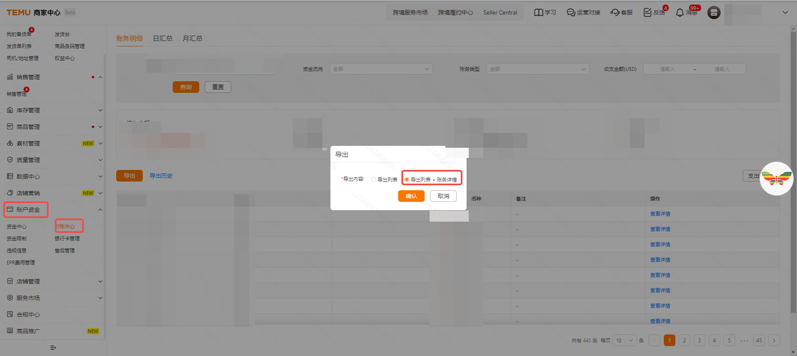
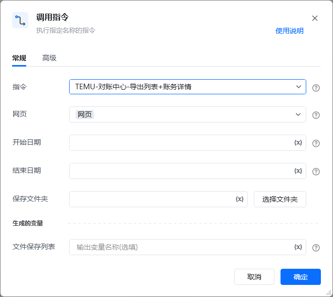

# Temu-账户资金-导出列表+账务详情
## 描述

该指令实现了Temu店铺 账户资金模块的财务明细，导出列表与财务详情
## 配置

<strong>输入</strong>

<strong>网页对象: web_page, </strong>待操作的网页对象

<strong>开始日期: str,</strong> 选择报表的开始时间 格式为 YYYY-MM-DD

<strong>结束日期: str,</strong>  选择报表的结束时间 格式为 YYYY-MM-DD

<strong>保存文件夹: str, </strong>文件的保存地址
## 使用说明
### 场景

https://seller.kuajingmaihuo.com/labor/bill[https://seller.kuajingmaihuo.com/labor/bill](https://seller.kuajingmaihuo.com/labor/bill)

<strong>参考流程</strong>

<strong>输出结果</strong>

<Info>
  使用指令过程中遇到问题？前往 [八爪鱼RPA 开发者社区问答板块](https://rpa.bazhuayu.com/community/questions) 提问，获取官方与社区帮助。
</Info>
