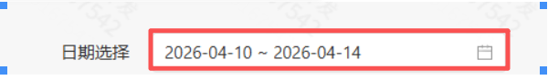

## 一、指令概述

该指令用于在 TEMU 商家后台中，自动操作日期筛选控件，设置指定的日期范围（开始日期与结束日期），支持YYYY-MM-DD格式的自定义日期输入，并需关联日期选择框的页面元素对象，适用于订单筛选、数据报表导出、业务分析等场景，可替代人工手动点击日期控件的操作。
## 二、核心参数配置参数名称说明输入格式 / 规则网页已登录 TEMU 后台的浏览器网页对象必填；需为有效的浏览器标签页对象，且已进入需要设置日期筛选的页面（如订单列表、数据报表）开始日期筛选数据的起始日期必填；格式为YYYY-MM-DD（如2025-01-01），需早于或等于结束日期结束日期筛选数据的结束日期必填；格式为YYYY-MM-DD（如2025-01-31），需晚于或等于开始日期日期选择框元素对象页面上日期筛选控件的元素对象必填；需通过「捕获新元素」功能，选择页面上的日期选择框 DOM 元素，确保指令能定位并操作控件
## 三、典型操作示例
示例：设置 2025 年 1 月的订单日期范围「网页」对象：选择已进入 TEMU 订单列表页面的浏览器标签页；「开始日期」：输入2026-03-01；「结束日期」：输入2025-03-31；「日期选择框元素对象」：捕获日期选择框元素；

执行后，指令会自动设置日期范围。
## 四、注意事项

<Info>
  使用指令过程中遇到问题？前往 [八爪鱼RPA 开发者社区问答板块](https://rpa.bazhuayu.com/community/questions) 提问，获取官方与社区帮助。
</Info>
