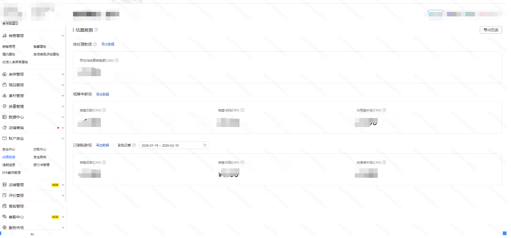
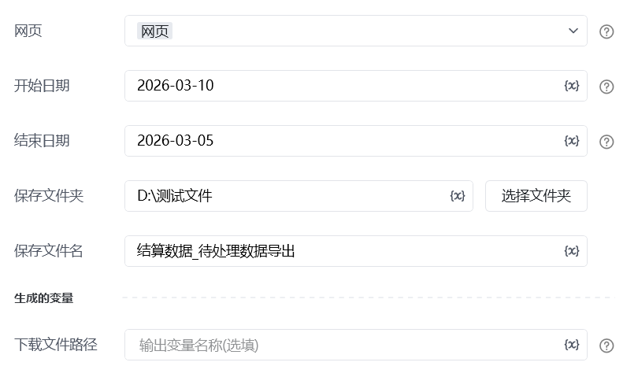

# Temu-结算数据-待处理数据导出
## 描述

该指令实现了对Temu的结算数据进行导出
## 参数配置
### 指令输入

<strong>网页对象: </strong> 网页对象

<strong>保存文件夹：</strong>选择一个保存文件夹地址

<strong>保存文件名：</strong>自定义文件名称

开始日期：YYYY-MM-DD

结束日期：YYYY-MM-DD
### 指令输出

<strong>文件路径: </strong> 输出下载报表的文件路径
## 参考案列
### https://agentseller.temu.com/labor/settle[https://agentseller.temu.com/labor/settle](https://agentseller.temu.com/labor/settle)

<Info>
  使用指令过程中遇到问题？前往 [八爪鱼RPA 开发者社区问答板块](https://rpa.bazhuayu.com/community/questions) 提问，获取官方与社区帮助。
</Info>
