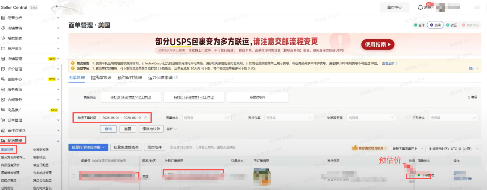

## 一、指令概述

本指令用于 Temu 商家后台【配送管理 - 面单管理】页面，根据站点、物流下单日期区间筛选面单数据，自动导出物流面单明细 Excel 文件；适用于物流对账、发货面单核对、尾程物流成本统计、备货发货复盘场景。

## 二、输入参数明细参数名称控件类型填写规则 & 可选值参数作用网页对象变量选择器取自上一步切换店铺指令输出的网页变量绑定已打开 Temu 商家后台的浏览器页面，用于定位页面筛选、导出控件站点单选下拉框全球、美国、欧区筛选目标业务站点，限定导出对应区域物流面单数据物流下单开始日期输入框格式强制YYYY-MM-DD物流下单时间统计区间起始日期物流下单结束日期输入框格式强制YYYY-MM-DD物流下单时间统计区间截止日期文件保存路径文件夹选择框本地文件夹绝对路径导出 Excel 文件的本地存放根目录自定义文件名称输入框自定义名称，无需填写.xlsx后缀导出报表文件名，支持拼接站点、日期变量区分多批次文件
## 三、输出参数参数名称说明文件路径输出变量，存储导出文件完整本地路径，可直接传入「读取 Excel」「上传文件到钉钉文件存储」等后续指令
## 四、实操配置示例

<Info>
  使用指令过程中遇到问题？前往 [八爪鱼RPA 开发者社区问答板块](https://rpa.bazhuayu.com/community/questions) 提问，获取官方与社区帮助。
</Info>
