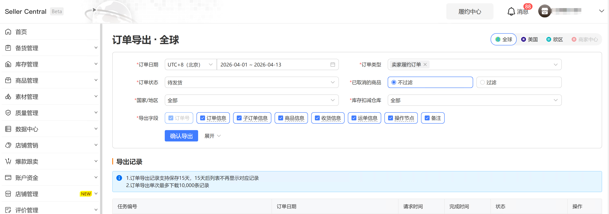
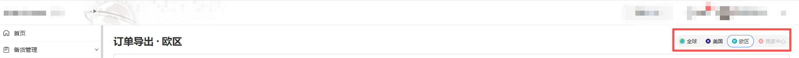
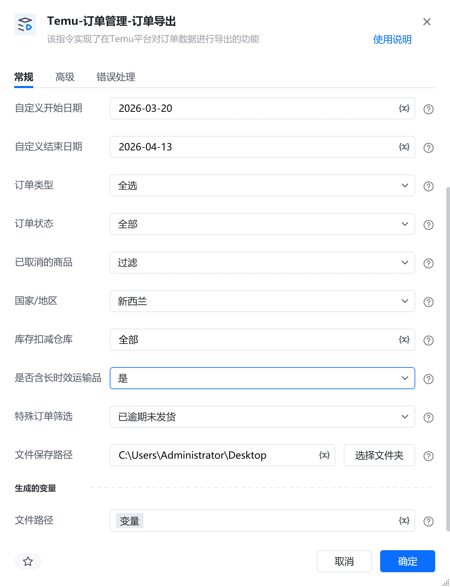
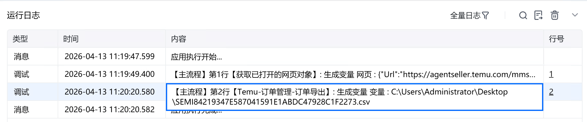

# 描述

该指令实现了在Temu平台对订单数据进行导出的功能

# 配置说明
## 输入

<strong>网页对象:</strong>

任意一个已登录Temu后台的网页对象

<strong>站点：</strong>

<strong>订单日期类型:</strong>

选择订单日期类型

<strong>订单日期范围:</strong>

选择订单日期范围

<strong>自定义开始日期:</strong>

填写自定义开始日期，格式必须为：YYYY-MM-DD

<strong>自定义结束日期:</strong>

填写自定义结束日期，格式必须为：YYYY-MM-DD

<strong>订单类型:</strong>

选择订单类型

<strong>订单状态:</strong>

选择订单状态

<strong>已取消的商品:</strong>

选择是否已取消的商品

<strong>国家/地区:</strong>

选择国家/地区

<strong>库存扣减仓库:</strong>

填写库存扣减仓库，必须与平台选项一致

<strong>是否含长时效运输品:</strong>

选择是否含长时效运输品，选填

<strong>特殊订单筛选:</strong>

选择特殊订单筛选，选填

<strong>文件保存路径:</strong>

选择文件保存路径
## 输出

<strong>文件路径：</strong>

输出完整的文件保存路径，文本类型
# 使用示例

# 运行结果

<Info>
  使用指令过程中遇到问题？前往 [八爪鱼RPA 开发者社区问答板块](https://rpa.bazhuayu.com/community/questions) 提问，获取官方与社区帮助。
</Info>
