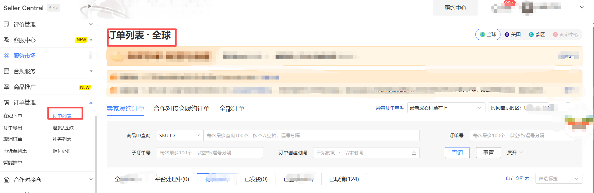
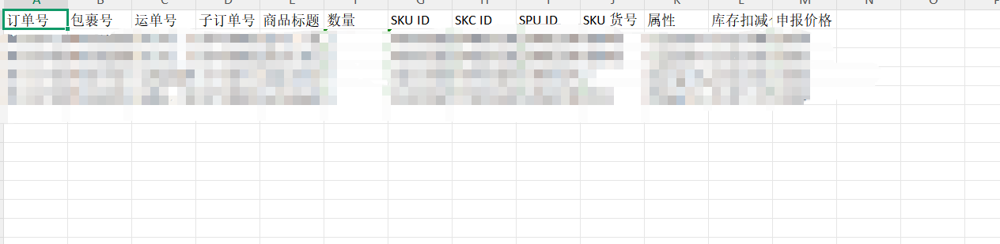

一、指令概述

本指令适配 Temu Seller Central 商家后台「履约中心」订单页面，自动化完成筛选条件配置 + 订单列表表格全字段数据抓取，支持多站点、多订单类型、多履约状态筛选，批量采集订单基础信息，导入Excel表格

二、输入参数配置说明

1. 订单类型（单选下拉框）

可选值：

卖家履约订单

合作对接仓履约订单：

2. 站点（输入框）

可选填写内容：美国、欧区、商家中心

3. 订单状态（单选下拉框）

可选值：平台处理中、待发货、已发货、已签收、全部

4.文件夹名称：选择保存的文件夹路径

5.文件名称:填写保存的文件名称

输出变量：

输出路径：输出文件保存的完整路径

三、实操配置示例

订单类型：卖家履约订单

站点：全球

订单状态：已签收

保存文件名称：D:\测试文件

文件名称：测试

输出：D:\测试文件\测试.xlsx

采集结果：

四、注意事项与异常排查

页面前置依赖

<Info>
  使用指令过程中遇到问题？前往 [八爪鱼RPA 开发者社区问答板块](https://rpa.bazhuayu.com/community/questions) 提问，获取官方与社区帮助。
</Info>
