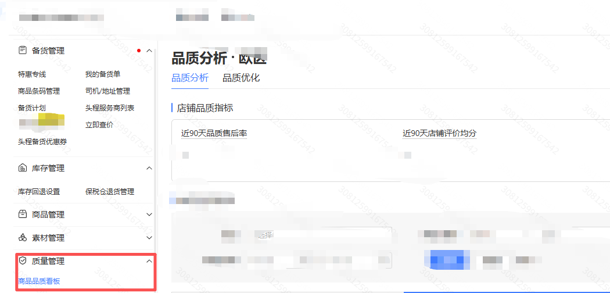
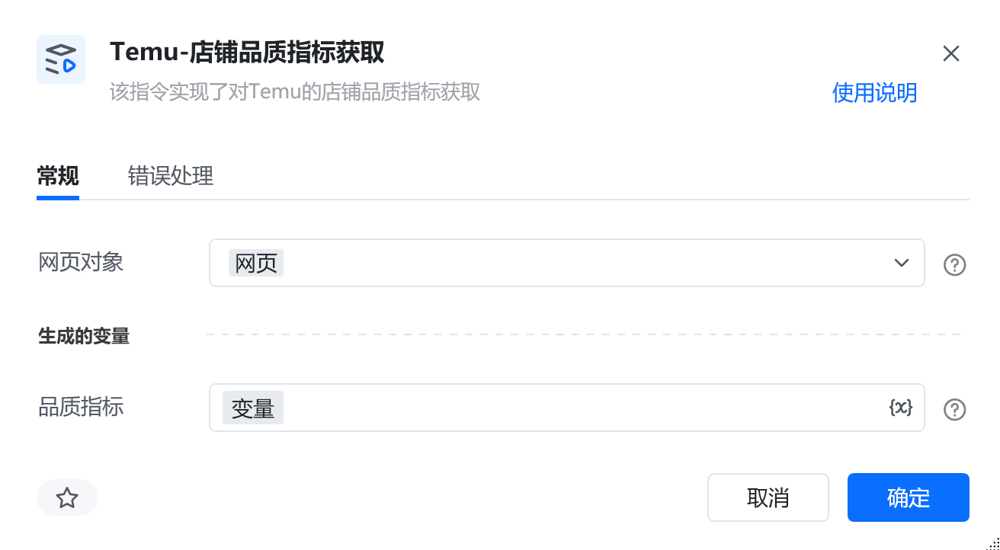
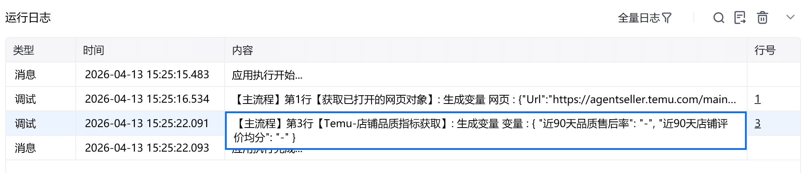

# 描述

该指令实现了对Temu的店铺品质指标获取

# 配置说明
## 输入

<strong>网页对象:</strong>

任意一个已登录Temu后台的网页对象
## 输出

<strong>品质指标：</strong>

返回店铺品质指标数据，字典类型
# 使用示例

# 运行结果

<Info>
  使用指令过程中遇到问题？前往 [八爪鱼RPA 开发者社区问答板块](https://rpa.bazhuayu.com/community/questions) 提问，获取官方与社区帮助。
</Info>
