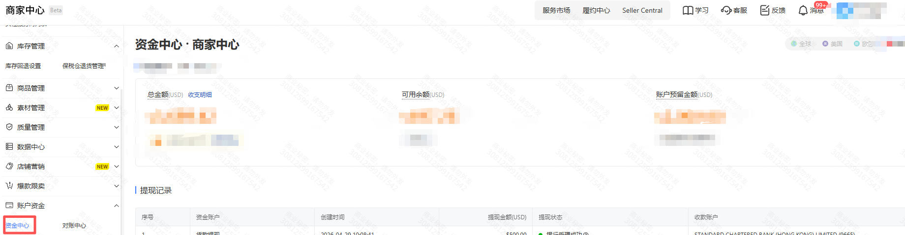
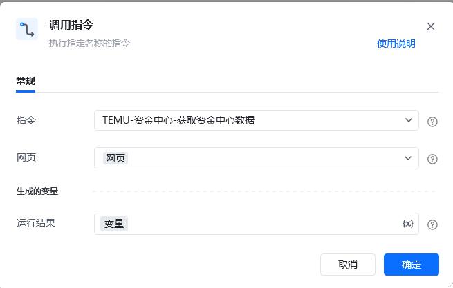
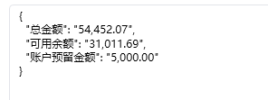

# Temu-资金中心-获取资金中心数据

该指令实现了获取资金中心数据

### 指令输入

<strong>网页对象: </strong> 网页对象
### 指令输出

<strong>运行结果: </strong> 资金中心数据字典

<strong>场景描述</strong>

https://seller.kuajingmaihuo.com/labor/account[https://seller.kuajingmaihuo.com/labor/account](https://seller.kuajingmaihuo.com/labor/account)

<strong>流程配置</strong>

<strong>执行结果</strong>

<Info>
  使用指令过程中遇到问题？前往 [八爪鱼RPA 开发者社区问答板块](https://rpa.bazhuayu.com/community/questions) 提问，获取官方与社区帮助。
</Info>
