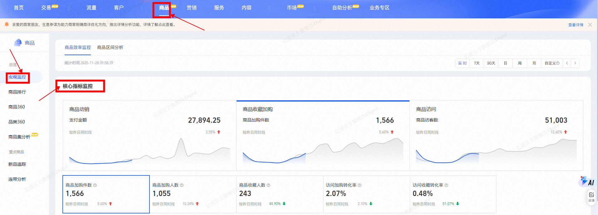
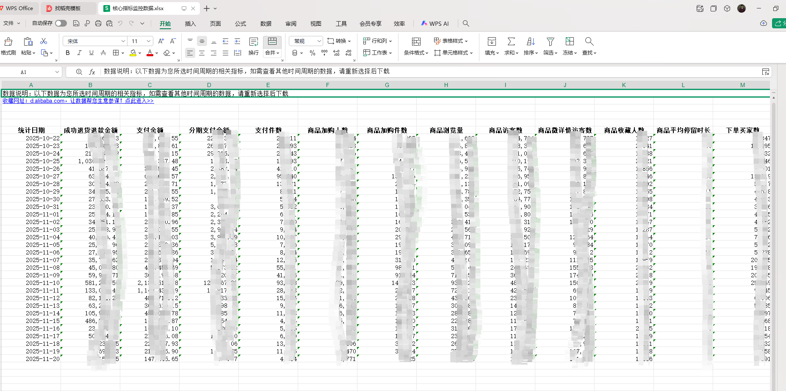

# 品类-宏观监控-核心指标监控数据获取
# 描述

该指令实现了【生意参谋】->【商品】->【宏观监控】->【核心指标监控】部分的数据获取，并将数据写入到Excel文件保存到指定路径下；

# 配置说明
适用的浏览器类型Google Chrome浏览器

## 输入

网页对象：已打开的浏览器对象

日期类型：可选择想要取数的维度日期或者快捷日期

日  /  周  /  月  /  自定义 /  实 时   /  7天  / 30天

自定义：* 最少选择 1 天,最多选择 31 天

保存文件夹：请输入数据文件保存的文件夹路径

文件名称：自定义自己想要命名的文件名称
## 输出

输出文件路径：输出数据文件的路径

## 数据展示

<Info>
  使用指令过程中遇到问题？前往 [八爪鱼RPA 开发者社区问答板块](https://rpa.bazhuayu.com/community/questions) 提问，获取官方与社区帮助。
</Info>
