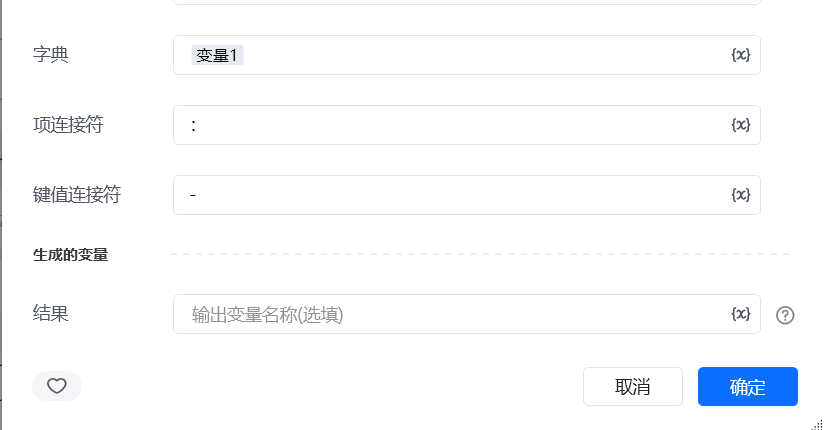
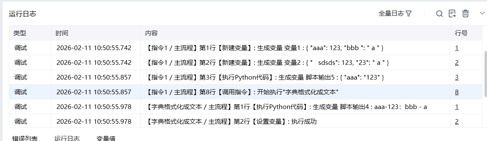

## 一、指令概述

用于将字典的键值对按自定义规则拼接成文本字符串，适用于生成 URL 参数、日志格式、接口请求体等场景，可灵活控制键值对的连接方式与整体格式。

## 二、调用参数配置参数名称配置说明约束规则字典待格式化的目标字典（如\{"姓名": "张三", "年龄": 25\}）必填；键需为字符串类型，值可支持字符串、数字等常见类型项连接符不同键值对之间的连接符号（如&、;、\n）必填；用于分隔字典中的多个键值对键值连接符键与值之间的连接符号（如=、:、:）必填；用于连接单个键值对的键与值生成的变量存储格式化后文本的变量名称必填；用于承接输出结果，供下游指令调用
## 三、输出说明

## 四、典型操作示例

<Info>
  使用指令过程中遇到问题？前往 [八爪鱼RPA 开发者社区问答板块](https://rpa.bazhuayu.com/community/questions) 提问，获取官方与社区帮助。
</Info>
