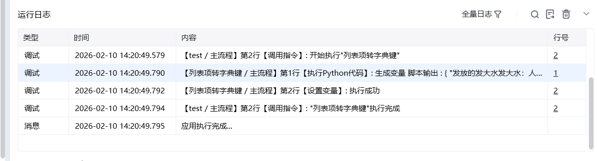

## 一、指令概述

用于将列表中的每一项转换为字典的键（值通常为空或默认值），适用于数据结构转换场景，可快速将列表形式的标识（如字段名、ID）转换为字典结构，便于后续数据映射、键值对填充等操作。

## 二、调用参数配置参数名称配置说明约束规则列表待转换的任意值列表（如["姓名", "年龄", "性别"]）必填；列表项需为可作为字典键的类型（如字符串、数字）生成的变量存储转换后新字典的变量名称必填；用于承接输出结果，供下游指令调用
## 三、输出说明

## 四、典型操作示例

<Info>
  使用指令过程中遇到问题？前往 [八爪鱼RPA 开发者社区问答板块](https://rpa.bazhuayu.com/community/questions) 提问，获取官方与社区帮助。
</Info>
