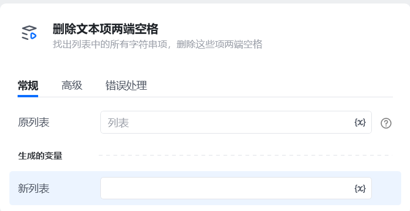
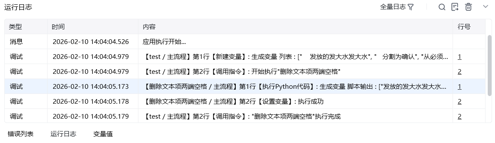

## 一、指令概述

用于批量处理字符串列表，自动移除列表中每个字符串项两端的空格（包括空格、制表符等空白字符），适用于数据清洗、文本预处理等场景，可解决因字符串前后空格导致的匹配失败、格式混乱等问题。

## 二、调用参数配置参数名称配置说明约束规则原列表待处理的字符串列表（如[" 测试1 ", "测试2 ", " 测试3"]）必填，数据类型：任意值列表生成的变量存储处理后新列表的变量名称必填；用于承接输出结果，供下游指令调用
## 三、输出说明

## 四、典型操作示例

<Info>
  使用指令过程中遇到问题？前往 [八爪鱼RPA 开发者社区问答板块](https://rpa.bazhuayu.com/community/questions) 提问，获取官方与社区帮助。
</Info>
