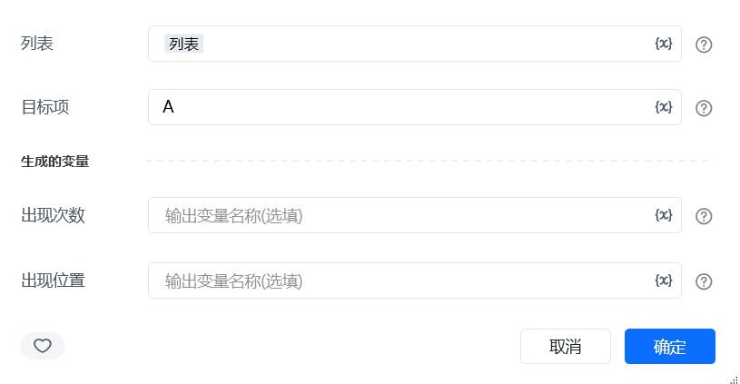
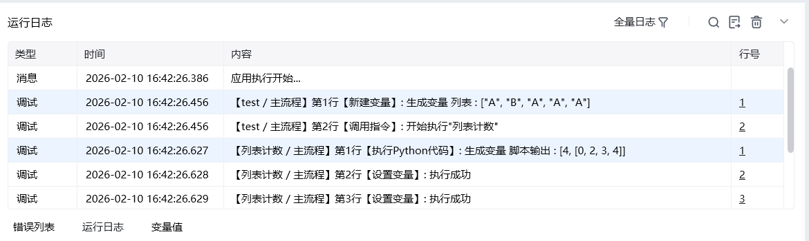

## 一、指令概述

用于统计目标项在列表中出现的次数与具体位置，适用于数据统计、内容定位等场景，可快速获取指定元素的分布情况，辅助后续的数据分析或内容筛选操作。

## 二、调用参数配置参数名称配置说明约束规则列表待统计的目标列表（如["A", "B", "A", "C", "A"]）必填；支持任意类型的一维列表目标项需统计的指定元素（如"A"）必填；需与列表中的元素类型一致生成的变量存储统计结果的变量名称必填；包含 “出现次数” 和 “出现位置” 两个子变量
## 三、输出说明

## 四、典型操作示例
示例：统计订单状态的出现次数与位置配置 “列表”：输入订单状态列表["已完成", "待发货", "已完成", "已取消", "已完成"]；配置 “目标项”：输入"已完成"；配置 “出现次数” 变量：命名为completed_count；配置 “出现位置” 变量：命名为completed_positions；执行指令后，completed_count为3，completed_positions为[0, 2, 4]，可用于分析已完成订单的分布情况。

<Info>
  使用指令过程中遇到问题？前往 [八爪鱼RPA 开发者社区问答板块](https://rpa.bazhuayu.com/community/questions) 提问，获取官方与社区帮助。
</Info>
