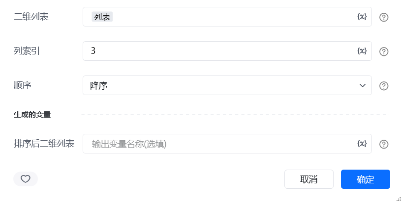
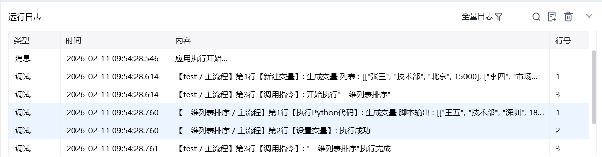

## 一、指令概述

用于将二维列表按指定列的字段内容进行升序或降序排序，适用于表格数据有序化展示、按维度排序统计等场景，可使数据按业务需求呈现规律化排列。

## 二、调用参数配置参数名称配置说明约束规则二维列表待排序的目标二维列表（如[["订单001", 200], ["订单002", 100], ["订单003", 150]]）必填；需为包含子列表的二维结构，子列表长度需一致列索引作为排序依据的列的索引（从 0 开始计数），如1代表按第二列排序必填；需为非负整数，且不超过二维列表的列数范围顺序排序方式，可选 “升序”“降序”必填；决定数据的排列方向生成的变量存储排序后二维列表的变量名称必填；用于承接输出结果，供下游指令调用
## 三、输出说明

## 四、典型操作示例
示例：按订单金额降序排序配置 “二维列表”：输入[["001", "张三", 100], ["002", "李四", 200], ["003", "王五", 180]]；配置 “列索引”：输入2（金额列）；配置 “顺序”：选择 “降序”；配置 “生成的变量”：命名为sorted_orders；执行指令后，sorted_orders变量存储按金额从高到低排列的订单列表，可用于优先处理高金额订单。

<Info>
  使用指令过程中遇到问题？前往 [八爪鱼RPA 开发者社区问答板块](https://rpa.bazhuayu.com/community/questions) 提问，获取官方与社区帮助。
</Info>
