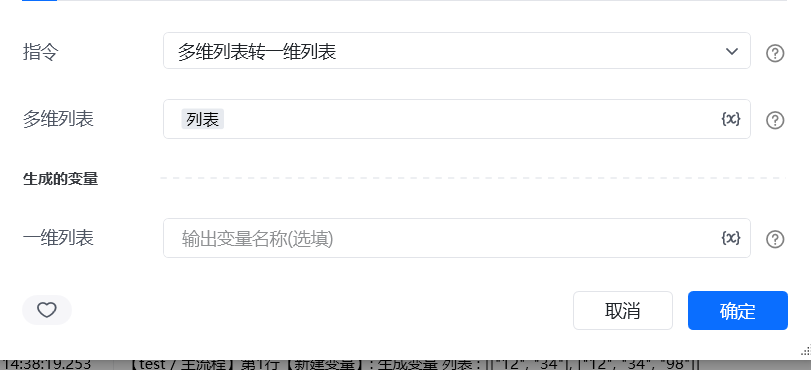
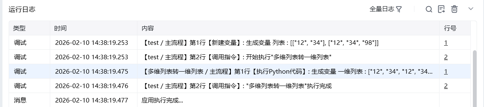

## 一、指令概述

用于将嵌套的多维列表（如列表中包含子列表）“扁平化” 为一维列表，适用于数据格式统一、批量处理等场景，可解决嵌套列表无法直接遍历、统计的问题。

## 二、调用参数配置参数名称配置说明约束规则多维列表待扁平化的嵌套列表（如[[1,2], [3,4,5], [6]]）必填；支持任意层级的嵌套列表生成的变量存储扁平化后一维列表的变量名称必填；用于承接输出结果，供下游指令调用
## 三、输出说明

## 四、典型操作示例

<Info>
  使用指令过程中遇到问题？前往 [八爪鱼RPA 开发者社区问答板块](https://rpa.bazhuayu.com/community/questions) 提问，获取官方与社区帮助。
</Info>
