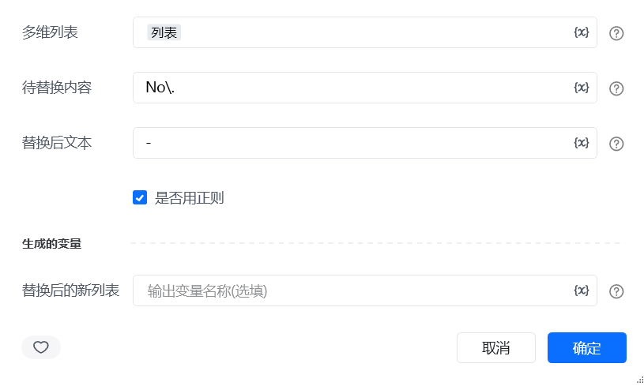
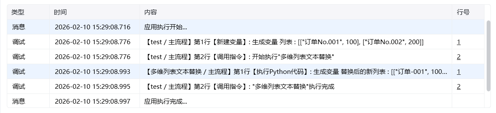

## 一、指令概述

用于对多维列表中的文本执行内容替换操作，支持普通文本匹配或正则表达式匹配，适用于批量数据清洗、格式统一等场景，可快速替换嵌套列表中分散的目标文本。

## 二、调用参数配置参数名称配置说明约束规则多维列表待处理的嵌套列表（如[["订单-001", "已完成"], ["订单-002", "待发货"]]）必填；支持任意值列表待替换内容要被替换的目标文本（或正则表达式）必填；若勾选 “是否用正则”，需符合正则语法替换后文本替换后的新文本内容必填；需与待替换内容的格式匹配（如正则替换时需对应分组）是否用正则勾选后，待替换内容将作为正则表达式执行匹配选填；默认不勾选，为普通文本匹配生成的变量存储替换后新列表的变量名称必填；用于承接输出结果，供下游指令调用
## 三、输出说明

## 四、典型操作示例
示例：统一订单编号格式（正则替换）配置 “多维列表”：输入[["订单No.001", 100], ["订单No.002", 200]]；配置 “待替换内容”：输入正则表达式No\.；配置 “替换后文本”：输入-；勾选 “是否用正则”；配置 “生成的变量”：命名为formatted_order_list；执行指令后，formatted_order_list变量存储结果为[["订单-001", 100], ["订单-002", 200]]。

<Info>
  使用指令过程中遇到问题？前往 [八爪鱼RPA 开发者社区问答板块](https://rpa.bazhuayu.com/community/questions) 提问，获取官方与社区帮助。
</Info>
