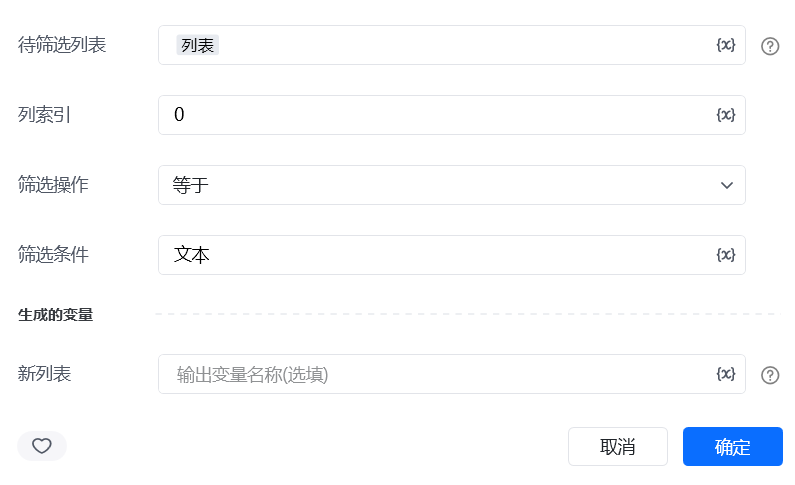
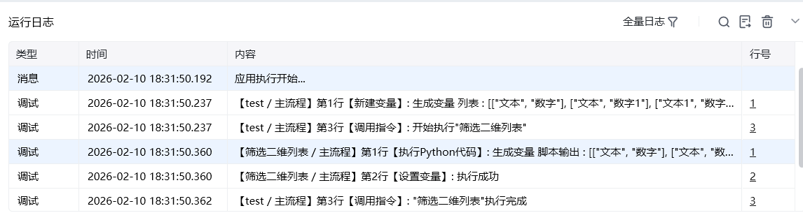

## 一、指令概述

用于按指定列的条件筛选二维列表，保留符合条件的行、删除不符合条件的行，适用于表格数据过滤、目标数据提取等场景，可精准筛选出业务所需的行数据。

## 二、调用参数配置参数名称配置说明约束规则待筛选列表需处理的二维列表（如[["订单001", 100], ["订单002", 200], ["订单003", 150]]）必填；需为包含子列表的二维结构，子列表长度需一致列索引用于筛选的列的索引（0 表示第一列，-1 表示倒数第一列）必填；需为整数，且不超过二维列表的列数范围筛选操作筛选的逻辑条件，可选：包含、不包含、等于、不等于、大于、小于、不大于、不小于必填；需根据列数据类型选择匹配的操作（如数字列选 “大于”，字符串列选 “包含”）筛选条件筛选的目标值（如200、"订单001"）必填；类型需与列数据类型匹配（如数字列填数字，字符串列填字符串）生成的变量存储筛选后新列表的变量名称必填；用于承接输出结果，供下游指令调用
## 三、输出说明

## 四、典型操作示例
示例：筛选金额大于 150 的订单配置 “待筛选列表”：输入[["001", "张三", 100], ["002", "李四", 200], ["003", "王五", 180]]；配置 “列索引”：输入2（金额列）；配置 “筛选操作”：选择 “大于”；配置 “筛选条件”：输入150；配置 “生成的变量”：命名为high_amount_orders；执行指令后，high_amount_orders变量存储结果为[["002", "李四", 200], ["003", "王五", 180]]。

<Info>
  使用指令过程中遇到问题？前往 [八爪鱼RPA 开发者社区问答板块](https://rpa.bazhuayu.com/community/questions) 提问，获取官方与社区帮助。
</Info>
