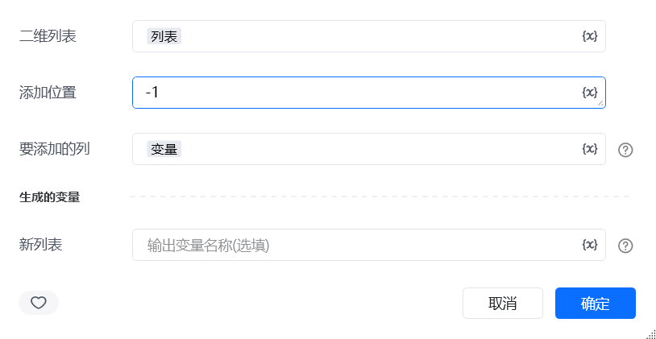
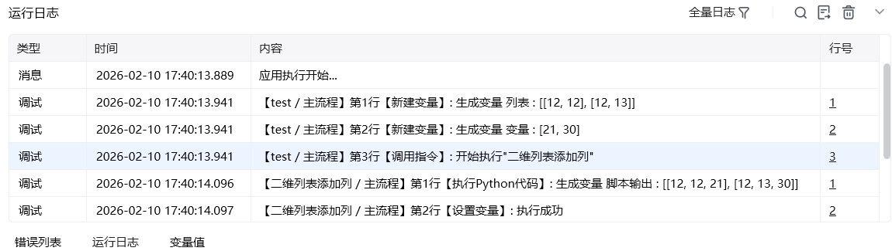

## 一、指令概述

用于向二维列表的指定位置插入一列数据，适用于表格数据补充、列结构扩展等场景，可灵活调整二维列表的列布局，满足数据完善的需求。

## 二、调用参数配置参数名称配置说明约束规则二维列表待添加列的目标二维列表（如[["张三", 25], ["李四", 30]]）必填；需为包含子列表的二维结构，子列表长度需一致添加位置列的插入位置（从 0 开始计数，支持负数：-1 表示末尾），如1代表在第 1 列前插入必填要添加的列待插入的一维列表（如["男", "女"]），长度需与二维列表的行数一致必填；列表长度需与二维列表的行数匹配，否则会导致数据错位生成的变量存储添加列后新列表的变量名称必填；用于承接输出结果，供下游指令调用
## 三、输出说明

## 四、典型操作示例
示例：为订单列表添加 “状态” 列配置 “二维列表”：输入[["001", 100], ["002", 200]]；配置 “添加位置”：输入-1（插入到末尾）；配置 “要添加的列”：输入["已完成", "待发货"]；配置 “生成的变量”：命名为order_with_status；执行指令后，order_with_status变量存储结果为[["001", 100, "已完成"], ["002", 200, "待发货"]]，可用于表格展示。

<Info>
  使用指令过程中遇到问题？前往 [八爪鱼RPA 开发者社区问答板块](https://rpa.bazhuayu.com/community/questions) 提问，获取官方与社区帮助。
</Info>
