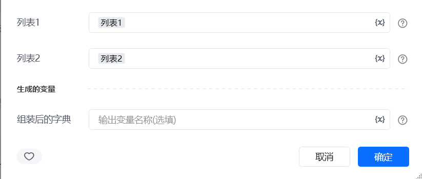
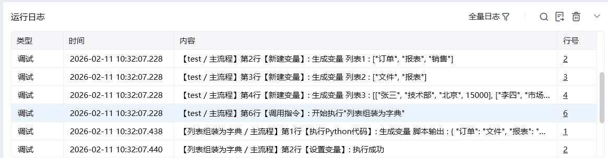

## 一、指令概述

用于将两个一维列表按相同位置的项一一对应，组装为一个字典：<strong>列表 1 的项作为键，列表 2 对应位置的项作为值</strong>，适用于键值对映射、数据结构转换等场景，可快速将线性数据转换为可直接索引的字典结构。

## 二、调用参数配置参数名称配置说明约束规则列表 1作为字典键的列表（如["姓名", "年龄", "性别"]）必填；长度需与列表 2 一致列表 2作为字典值的列表（如["张三", 25, "男"]）必填；长度需与列表 1 一致，否则会导致键值不对应生成的变量存储组装后字典的变量名称必填；用于承接输出结果，供下游指令调用
## 三、输出说明

## 四、典型操作示例
示例：将字段名与字段值组装为数据字典配置 “列表 1”：输入字段名列表["订单ID", "客户名称", "订单金额"]；配置 “列表 2”：输入对应字段值列表["001", "张三", 1000]；配置 “生成的变量”：命名为order_dict；执行指令后，order_dict变量存储结果为\{"订单ID": "001", "客户名称": "张三", "订单金额": 1000\}，可直接用于数据索引与填充。

<Info>
  使用指令过程中遇到问题？前往 [八爪鱼RPA 开发者社区问答板块](https://rpa.bazhuayu.com/community/questions) 提问，获取官方与社区帮助。
</Info>
