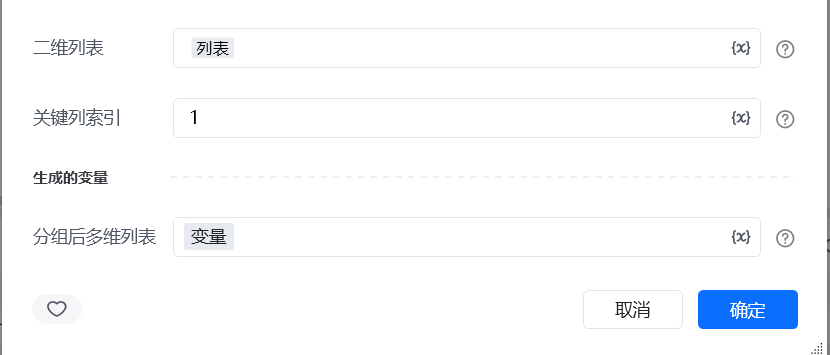
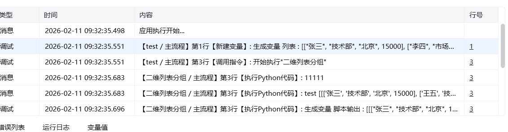

## 一、指令概述

用于将二维列表按指定列（关键字列）的内容进行分组，将同一关键字对应的行聚合为子列表，适用于数据分类统计、批量分组处理等场景，可快速整理出按指定维度分类的数据集。

## 二、调用参数配置参数名称配置说明约束规则二维列表待分组的目标二维列表（如[["张三", "销售部"], ["李四", "技术部"], ["王五", "销售部"]]）必填；需为包含子列表的二维结构，子列表长度需一致关键字列索引作为分组依据的列的索引（从 0 开始计数），如1代表按第二列分组必填；需为非负整数，且不超过二维列表的列数范围生成的变量存储分组后多维列表的变量名称必填；用于承接输出结果，供下游指令调用
## 三、输出说明

## 四、典型操作示例

<Info>
  使用指令过程中遇到问题？前往 [八爪鱼RPA 开发者社区问答板块](https://rpa.bazhuayu.com/community/questions) 提问，获取官方与社区帮助。
</Info>
