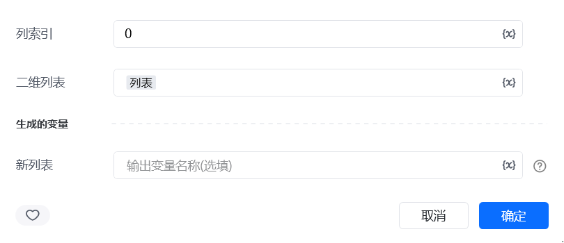
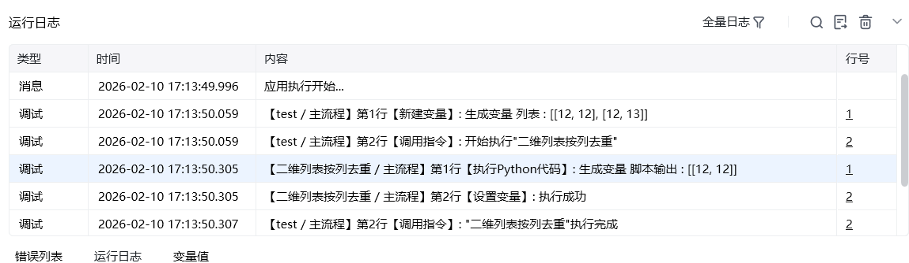

## 一、指令概述

用于对二维列表按指定列作为关键字，去除该列内容重复的行，适用于表格数据去重、重复记录清洗等场景，可保留指定列唯一的行数据，提升数据的唯一性与准确性。

## 二、调用参数配置参数名称配置说明约束规则列索引作为去重关键字的列的索引（从 0 开始计数，如0代表第一列）必填；需为非负整数，且不超过二维列表的列数范围二维列表待去重的二维列表（如[["订单001", 100], ["订单001", 200], ["订单002", 150]]）必填；需为包含子列表的二维结构，子列表长度需一致生成的变量存储去重后新列表的变量名称必填；用于承接输出结果，供下游指令调用
## 三、输出说明

## 四、典型操作示例
示例：清洗重复订单数据配置 “列索引”：输入0（以 “订单 ID” 列作为关键字）；配置 “二维列表”：输入[["001", "张三", 100], ["001", "李四", 200], ["002", "王五", 150]]；配置 “生成的变量”：命名为unique_order_list；执行指令后，unique_order_list变量存储结果为[["001", "张三", 100], ["002", "王五", 150]]，可用于后续订单统计。

<Info>
  使用指令过程中遇到问题？前往 [八爪鱼RPA 开发者社区问答板块](https://rpa.bazhuayu.com/community/questions) 提问，获取官方与社区帮助。
</Info>
