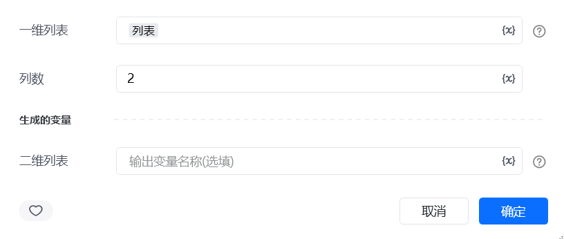
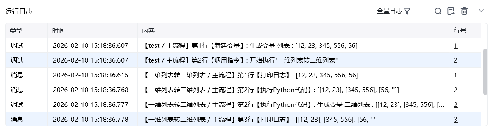

## 一、指令概述

用于将一维列表按照指定列数拆分为二维列表，适用于表格数据格式化、批量分组等场景，可将线性数据转换为结构化的行列形式，便于后续表格写入、数据展示等操作。

## 二、调用参数配置参数名称配置说明约束规则一维列表待拆分的线性列表（如["姓名", "张三", "年龄", 25, "性别", "男"]）必填；需为任意类型的一维列表列数拆分后二维列表的列数（如2）必填；需为正整数，决定每行包含的元素数量生成的变量存储拆分后二维列表的变量名称必填；用于承接输出结果，供下游指令调用
## 三、输出说明

## 四、典型操作示例
示例：将用户信息线性列表转换为表格结构配置 “一维列表”：输入["订单ID", "001", "客户名称", "张三", "订单金额", 1000]；配置 “列数”：输入2；配置 “生成的变量”：命名为order_table_data；执行指令后，order_table_data变量存储结果为[["订单ID", "001"], ["客户名称", "张三"], ["订单金额", 1000]]，可直接用于表格写入。

<Info>
  使用指令过程中遇到问题？前往 [八爪鱼RPA 开发者社区问答板块](https://rpa.bazhuayu.com/community/questions) 提问，获取官方与社区帮助。
</Info>
